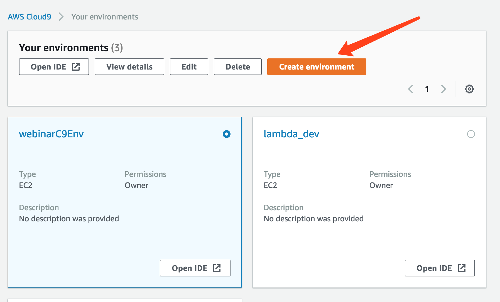
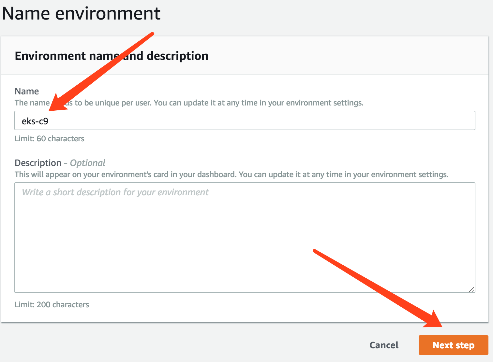
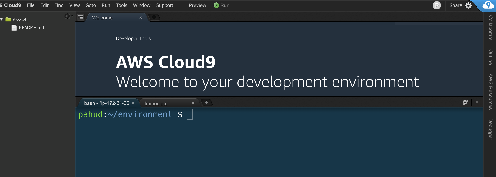
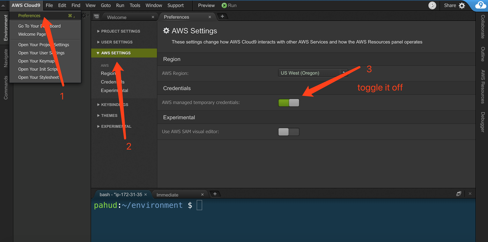
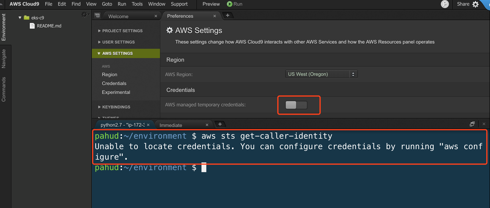
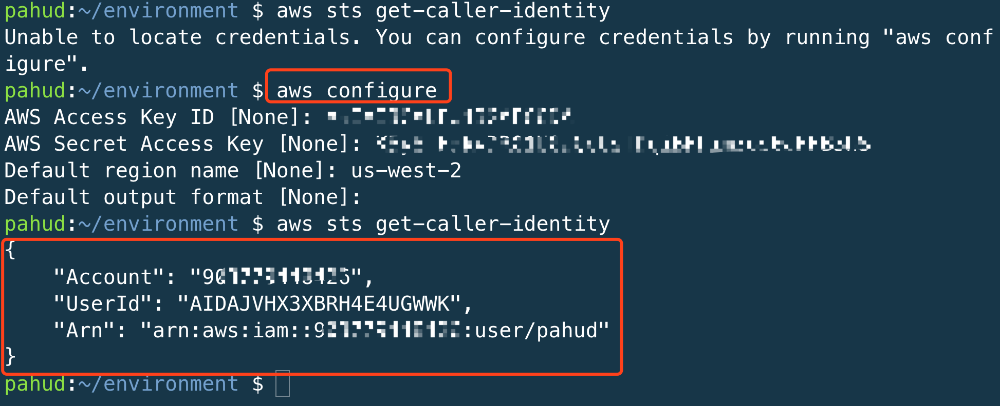
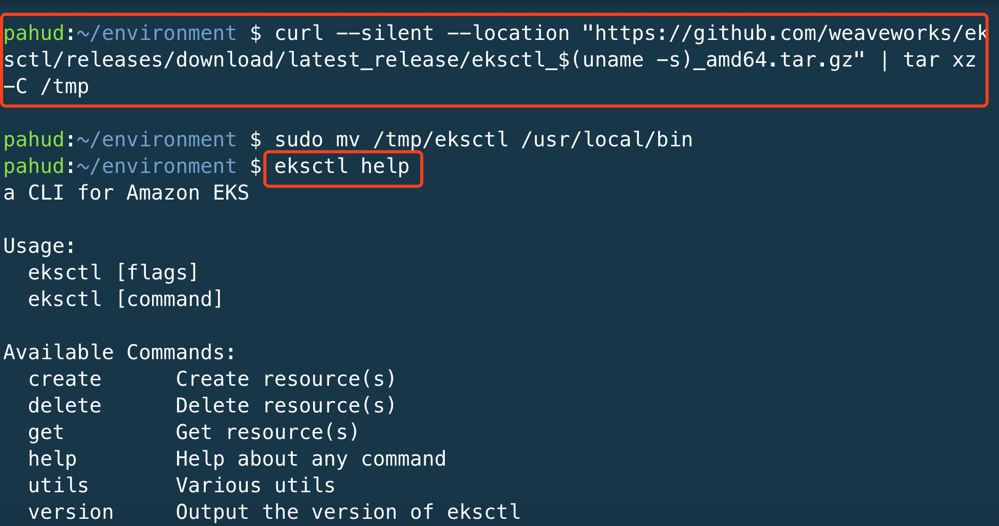
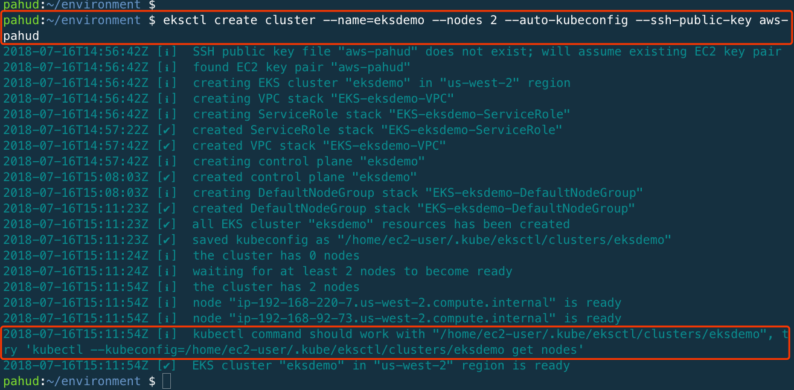
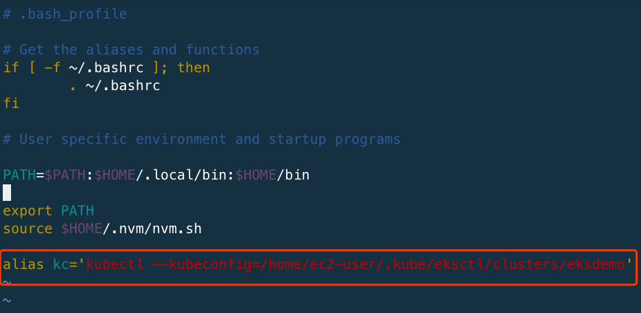
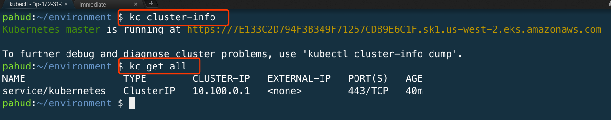

## Create your EKS Cluster with eksctl


`eksctl` is a CLI for Amazon EKS that helps you easily create Amazon EKS cluster!

eksctl website:  https://eksctl.io/

You may follow the Amazon EKS official document - [Getting Started with eksctl](https://docs.aws.amazon.com/eks/latest/userguide/getting-started-eksctl.html) to complete the cluster creation with `eksctl` or just follow the steps below.


## Steps

1. Spin up your [Cloud9 IDE](https://us-west-2.console.aws.amazon.com/cloud9/home?region=us-west-2) from AWS console.




2. Create and name your environment



3. Leave everythong as default and click **Next Step**
4. Click **Create environment**

(It would typically take 30-60s to create your Cloud9 IDE)



5. install the latest `aws-cli`

copy and paste the following script in the Cloud9 terminal and press enter.

```bash
cat << EOF | bash
cleanup() {
  rm -rf awscli-bundle
  rm -f awscli-bundle.zip
}


cleanup
rm -rf awscli-bundle*
curl "https://s3.amazonaws.com/aws-cli/awscli-bundle.zip" -o "awscli-bundle.zip"
unzip awscli-bundle.zip
sudo ./awscli-bundle/install -i /usr/local/aws -b /usr/local/bin/aws
EOF
```
check the awscli path and version

```bash
# check the path
$ which aws
/usr/local/bin/aws
# check the version
$ aws --version
aws-cli/1.16.184 Python/2.7.16 Linux/4.14.109-80.92.amzn1.x86_64 botocore/1.12.174
```
(make suer your version >= `1.16.184`)

6. We need to turn off the Cloud9 temporarily provided IAM credentials. 




7. When you turn off the temporary credentials, you should not be able to un AWS CLI now.




8. execute `aws configure` to configure the credentials for your IAM user. Make sure this IAM User has **AdministratorAccess** and run `aws sts get-caller-identity` - you should be able to see the returned JSON output like this.




9. Download the `kubectl` and save to `~/bin`. Check the Amazon EKS User Guide for [Installing kubectl](https://docs.aws.amazon.com/eks/latest/userguide/install-kubectl.html). 

```bash
$ curl https://amazon-eks.s3-us-west-2.amazonaws.com/1.14.6/2019-08-22/bin/linux/amd64/kubectl -o kubectl
$ chmod +x $_
$ sudo mv $_ /usr/local/bin/
```

10. Download the `eksctl` from `eksctl.io`(actually it will download from GitHub)

```bash
$ curl --silent --location "https://github.com/weaveworks/eksctl/releases/download/latest_release/eksctl_$(uname -s)_amd64.tar.gz" | tar xz -C /tmp
sudo mv /tmp/eksctl /usr/local/bin
```


11. run `eksctl help`, you should be able to see the `help` messages




## create cluster with eksctl


12. Create your Amazon EKS cluster witn `eksctl` and spin up a nodegroup with `2 nodes`

```bash
$ eksctl create cluster --name=<CLUSTER_NAME> --nodes 2 --auto-kubeconfig --ssh-public-key <EXISTING_SSH_KEY_NAME>
```



Or like this
```bash
eksctl create cluster \
  --name=eksdemo \
  --region=us-west-2 \
  --nodes=2 \
  --tags environment=develop \
  --node-type=m5.large \
  --ssh-access \
  --ssh-public-key=your_key_name \
  --node-private-networking \
  --vpc-private-subnets=subnet-ed2b93c3,subnet-e6c38eac \
  --vpc-public-subnets=subnet-36368e18,subnet-aec68be4
```

Alternatively, you may also create your cluster with cluster config file.

```bash
cat << EOF > cluster.yaml
apiVersion: eksctl.io/v1alpha4
kind: ClusterConfig

metadata:
  name: eksdemo
  region: us-west-2

nodeGroups:
  - name: ng0
    instanceType: m5.large
    desiredCapacity: 2
EOF
```

And then, just 

```bash
eksctl create cluster -f cluster.yaml
```


## Nodegroup of Mixed Instance Types and Purchase Options

If you prefer to hybrid on-demand and spot instances with mixed instance types in your nodegroup, you may also create your nodegroup like this:


```yaml
---
apiVersion: eksctl.io/v1alpha5
kind: ClusterConfig

metadata:
    name: eksdemo
    region: ap-northeast-1

nodeGroups:
    - name: ng-1
      minSize: 2
      maxSize: 5
      instancesDistribution:
        instanceTypes: ["t3.small", "t3.medium", "t3.large"] # At least two instance types should be specified
        onDemandBaseCapacity: 0
        onDemandPercentageAboveBaseCapacity: 0
        spotInstancePools: 2
```

save the YAML body as `mixed-ng.yaml` and create your cluster 

```bash
$ eksctl create cluster -f mixed-ng.yaml
```

This will spin up an Amazon EKS cluster with nodegroup of mixed instance types and purchase options(ondemand+spot), however, as we define `onDemandBaseCapacity: 0` and `onDemandPercentageAboveBaseCapacity: 0`, actually there will be only spot instances for the best cost optimization. You may configure those options to optionally have some ondemand instances as your baseline. Check [AWS document](https://docs.aws.amazon.com/autoscaling/ec2/userguide/asg-purchase-options.html) for more details about those attributes.


More cluster config samples from `eksctl` [github](https://github.com/weaveworks/eksctl/tree/master/examples)

## Generate kubeconfig with aws eks update-kubeconfig


And create/update your `$HOME/.kube/config` with `aws eks update-kubeconfig`

```bash
aws eks update-kubeconfig --name eksdemo
```

After executing `aws eks update-kubeconfig`, a new context will be generated in `$HOME/.kube/config` and you can execute `kubectl get no` to list all nodes in the nodegroup.





Get the `cluster-info` or `get all` resources.




Now your Amazon EKS cluster is ready!  You may proceed to [customize your nodegroup](../01-nodegroup/customize-nodegroup.md) now.

If you need to delete this clusrer, run `eksctl delete cluster —name=<CLUSTER_NAME>` to trigger the deletion of the stack.

