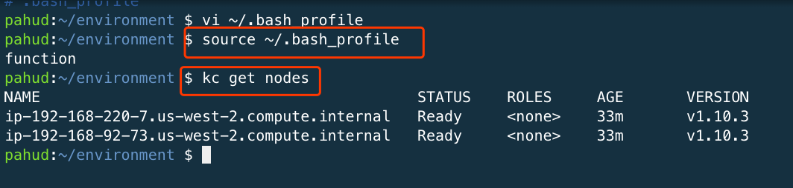

## Create your EKS Cluster with eksctl


`eksctl` is a CLI for Amazon EKS that helps you easily create Amazon EKS cluster!

eksctl website:  https://eksctl.io/


## Steps

1. Spin up your [Cloud9 IDE](https://us-west-2.console.aws.amazon.com/cloud9/home?region=us-west-2) from AWS console.


2. Create and name your environment


3. Leave everythong as default and click **Next Step**
4. Click **Create environment**

(It would typically take 30-60s to create your Cloud9 IDE)


5. We need to turn off the Cloud9 temporarily provided IAM credentials. 


6. When you turn off the temporary credentials, you should not be able to un AWS CLI now.


7. execute `aws configure` to configure the credentials for your IAM user. Make sure this IAM User has **AdministratorAccess** and run `aws sts get-caller-identity` - you should be able to see the returned JSON output like this.


8. Download the `kubectl` and `heptio-authenticator-aws` binaries and save to `~/bin`. Check the Amazon EKS User Guide for [Getting Started](https://docs.aws.amazon.com/eks/latest/userguide/getting-started.html). Download the Linux binary for `kubectl` and `heptio-authenticator-aws` one by one.

   ```
   $ mkdir ~/bin
   $ wget https://amazon-eks.s3-us-west-2.amazonaws.com/1.10.3/2018-06-05/bin/linux/amd64/kubectl && chmod +x kubectl && mv kubectl ~/bin/
   $ wget https://amazon-eks.s3-us-west-2.amazonaws.com/1.10.3/2018-06-05/bin/linux/amd64/heptio-authenticator-aws && chmod +x heptio-authenticator-aws && mv heptio-authenticator-aws ~/bin/
   ```

9. Download the `eksctl` from `eksctl.io`(actually it will download from GitHub)

   ```
   $ curl --silent --location "https://github.com/weaveworks/eksctl/releases/download/latest_release/eksctl_$(uname -s)_amd64.tar.gz" | tar xz -C /tmp
   sudo mv /tmp/eksctl /usr/local/bin
   ```


10. run `eksctl help`, you should be able to see the `help` messages


11. Create your Amazon EKS cluster witn `eksctl` and spin up a nodegroup with `2 nodes`

```
$ eksctl create cluster --name=<CLUSTER_NAME> --nodes 2 --auto-kubeconfig --ssh-public-key <EXISTING_SSH_KEY_NAME>
```


Then you should be able to `get nodes` like this:

```
kubectl --kubeconfig=/home/ec2-user/.kube/eksctl/clusters/eksdemo get nodes
```

Let's configure an `alias` in `~/.bash_profile`.  Open `~/.bash_profile` with your favorite editor e.g. `vim` and add an alias in the bottom:


Now you can execute `kubectl` command with the aliased command`kc`.





Get the `cluster-info` or `get all` resources.


Now your Amazon EKS cluster is ready! 

If you need to delete this clusrer, run `eksctl delete cluster —name=<CLUSTER_NAME>` to trigger the deletion of the stack.

