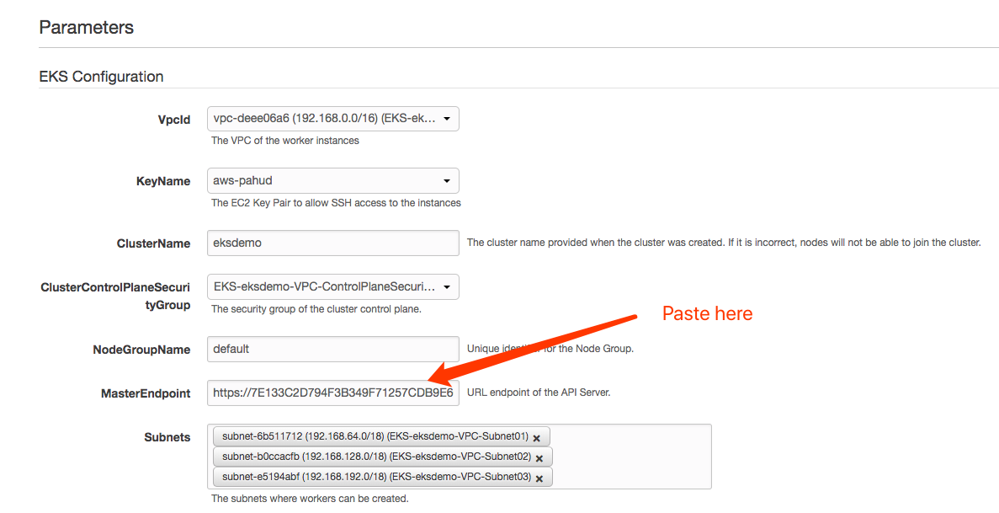

## Customize your nodegroup(worker nodes)

The `eksctl` by default will create your default nodegroup for you with cloudformation.

You can update this cloudformation stack with current stack and update `Parameters` to initiate the nodegroup update.

Or alternatively, update this cloudformation stack with template URL provided from [pahud/eks-template](https://github.com/pahud/eks-templates).

**Please Note**: You need to configure each public subnet as "**Auto Assign IPv4 public IP**" in the [VPC/Subnet console.]( VPC/Subnet console)This is a known issue of this alternative template.

click **Next** and you will need to update some Parameters as below

Get your MasterEndpoint by  `kc cluster-info`

Copy the `https://.....eks.amazonaws.com` URL and paste into **MasterEndpoint** parameter.

Now you can define both an `AutoScaling Group` and a `SpotFleet` in this template.

click Next and update your existing cloudformation stack

Now you have a customized `ASG` and a customized `SpotFleet` registering to the same K8s nodegroup.

You can list nodes from `ASG` and nodes from `SpotFleet` like this:

(this cluster consists of 2 on-demand nodes fron ASG and 3 spot nodes from spotfleet)

### What's Next?

The official Amazon EKS nodegroup cloudformation template can be found here - https://github.com/awslabs/amazon-eks-ami/blob/master/amazon-eks-nodegroup.yaml  - you can always customize your own nodegroup template based on the official one.