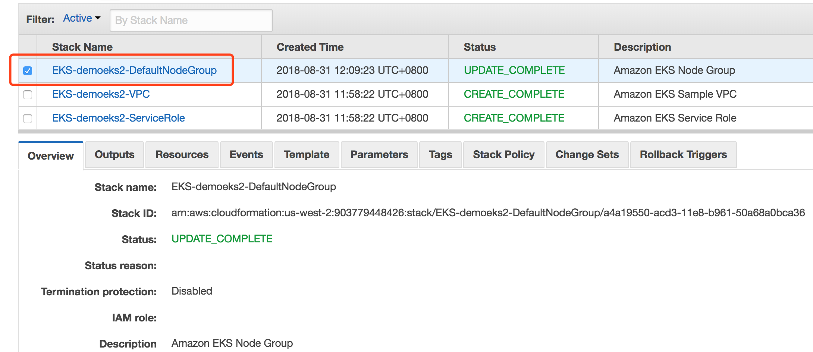
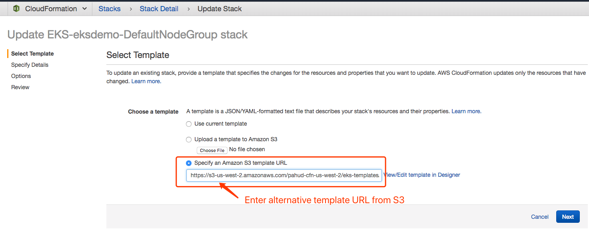
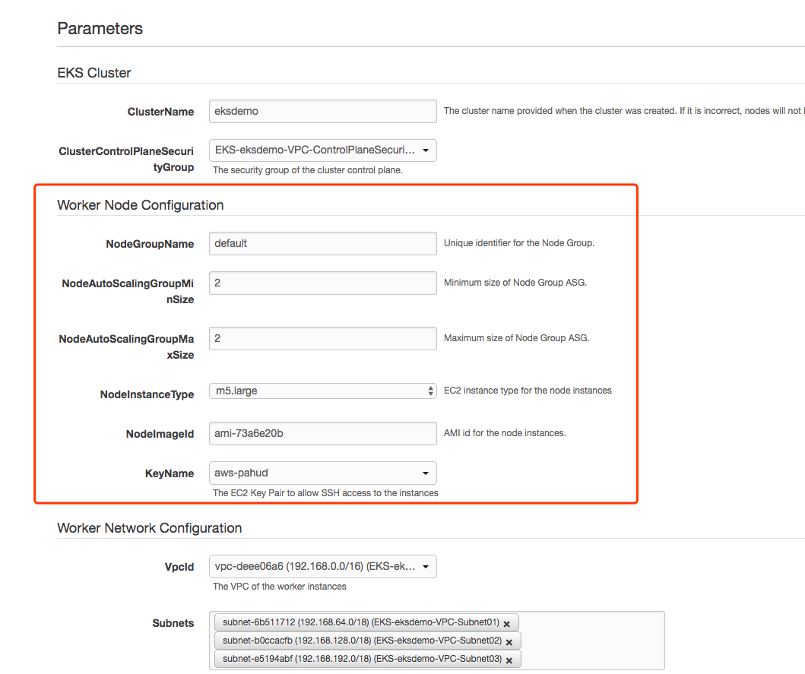
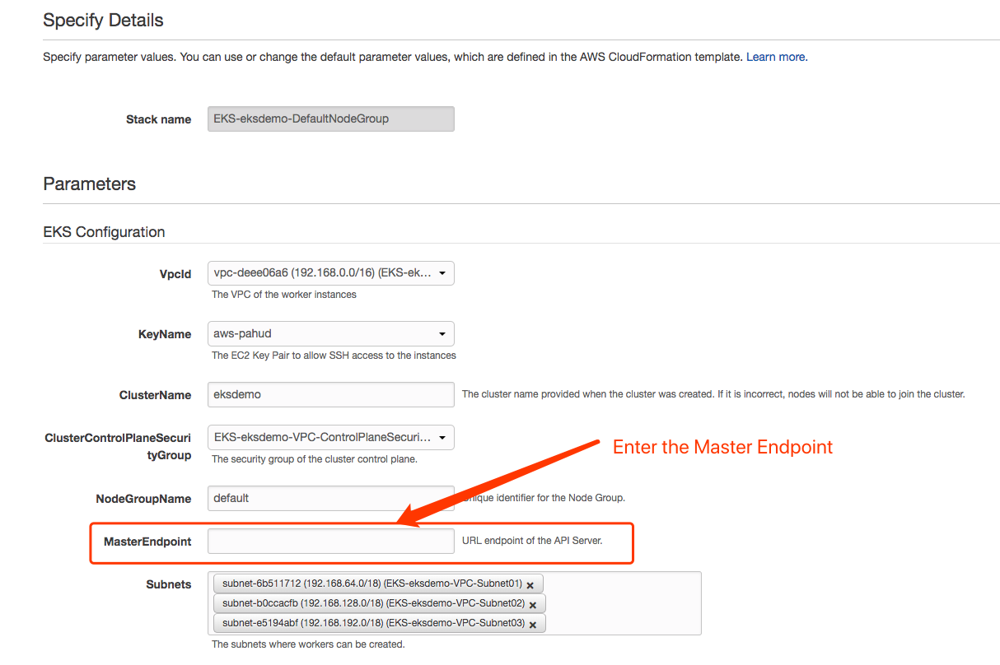
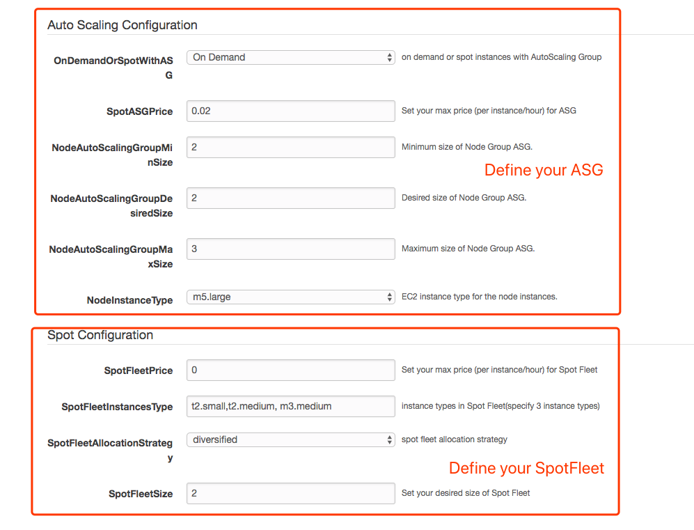
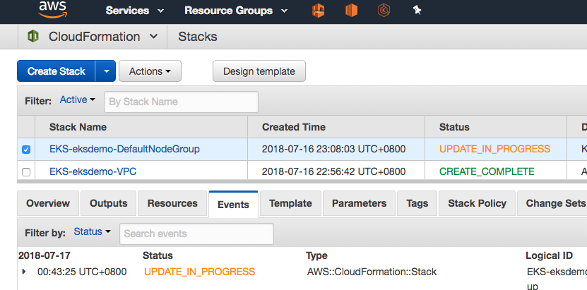
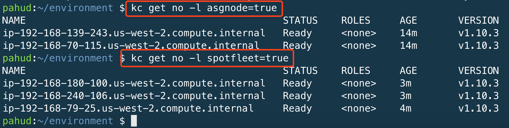

## Customize your nodegroup(worker nodes)

The `eksctl` by default will create your default nodegroup for you with cloudformation.




You can update this cloudformation stack with current stack and update `Parameters` to initiate the nodegroup update.

Or alternatively, update this cloudformation stack with template URL provided from [pahud/eks-template](https://github.com/pahud/eks-templates).

Paste the following URL into the "**Specify an Amazon S3 template URL**" input box

```
https://s3-us-west-2.amazonaws.com/pahud-cfn-us-west-2/eks-templates/cloudformation/nodegroup.yaml
```





click **Next** and you will need to update some Parameters as below

 **NodeImageId** - clear and empty this field to use the latest EKS-optimized AMI as default



**NodeAutoScalingGroupMaxSize** - make sure the value is higher than NodeAutoScalingGroupDesiredSize. You can set it to 3, 5 or any higher value.




Now you can define both an `AutoScaling Group`(above) and a `SpotFleet`(below) in this template. Both ASG and SpotFleet will hybrid your default Amazon EKS nodegroup with different node labels respectively.





click Next and update your existing cloudformation stack




Now you have a customized `ASG` and a customized `SpotFleet` registering to the same K8s nodegroup.

You can list nodes from `ASG` and nodes from `SpotFleet` like this:



(this cluster consists of 2 on-demand nodes fron ASG and 2 spot nodes from spotfleet)

### Scheduled Scaling with Spot Fleet

You may configure the scheduled scaling policy of your Spot Fleet in response to the predictable traffic spikes or just set max/min to 0 for your testing/development environment for the weeekend for cost optimization. Check this [tweet](https://twitter.com/pahudnet/status/1043720930638188544).


### What's Next?

The official Amazon EKS nodegroup cloudformation template can be found here - https://github.com/awslabs/amazon-eks-ami/blob/master/amazon-eks-nodegroup.yaml  - you can always customize your own nodegroup template based on the official one.
