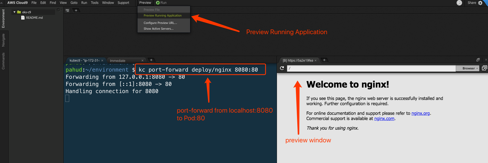
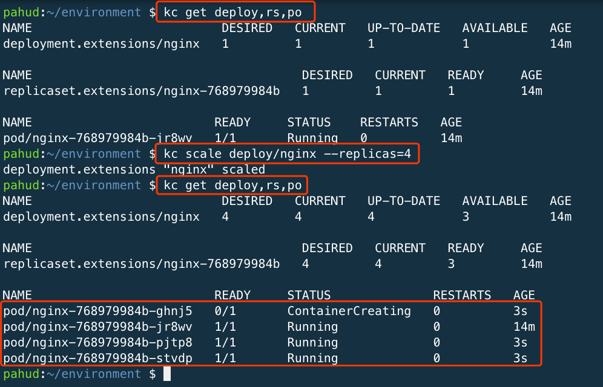
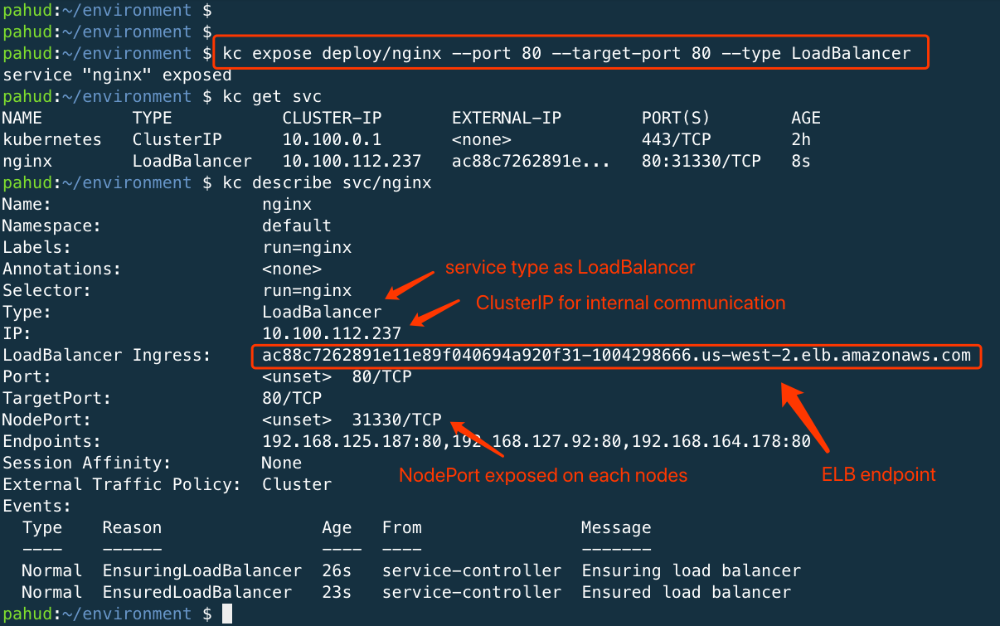
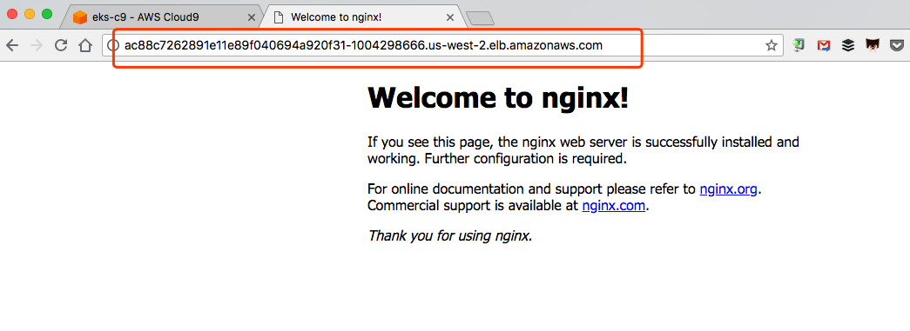
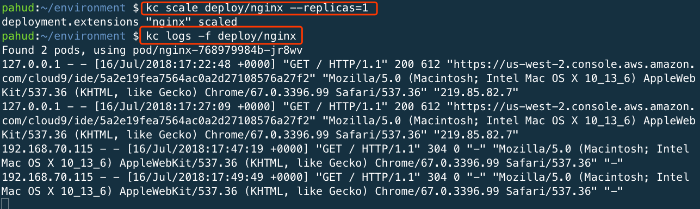
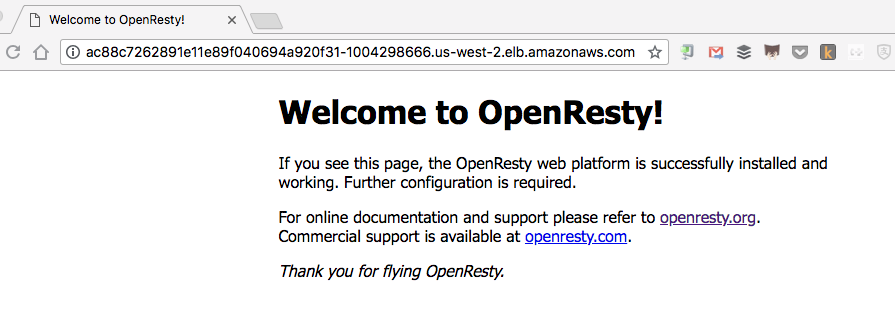
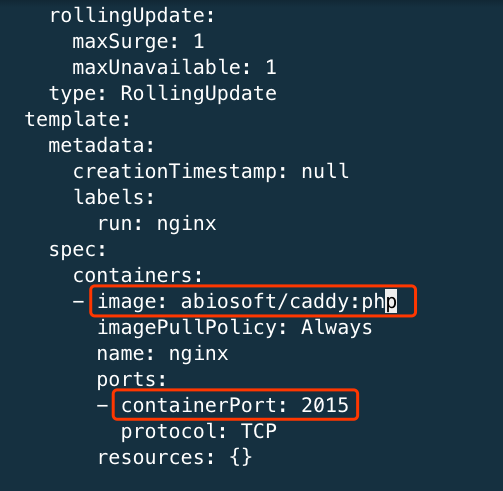
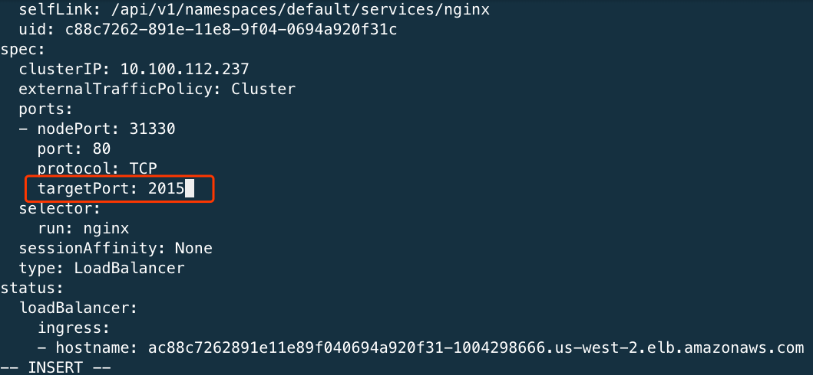
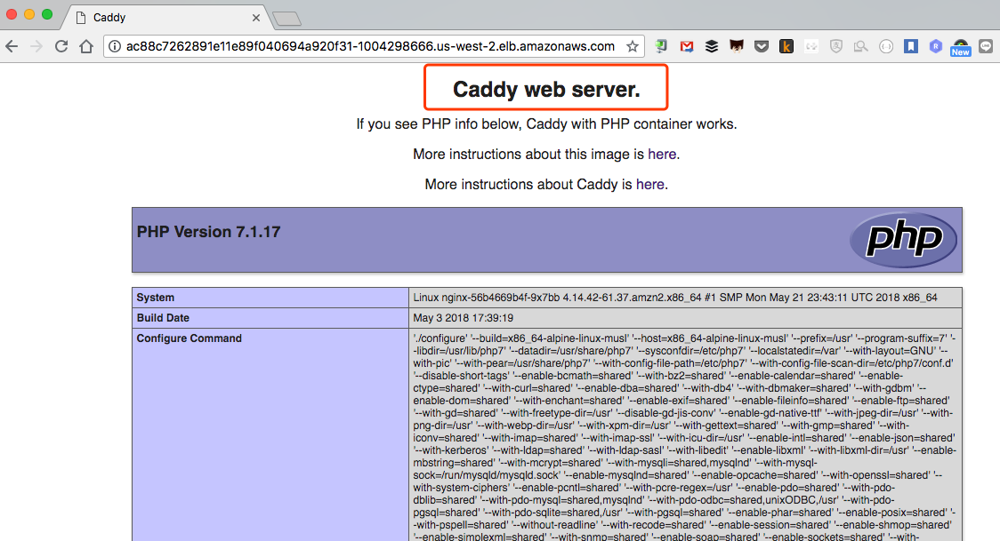

# Working with kubectl for basic administrations


Let's run your first Nginx deployment with `kubectl`

```
$ kubectl run nginx --image=nginx --port 80
deployment.apps "nginx" created
```


Under the hood, this will create one `deployment` with one `replicaset` with one single nginx `pod` for you. (please ignore `service/kubernetes`)

```
$ kubectl get all
NAME                         READY     STATUS    RESTARTS   AGE
pod/nginx-768979984b-jr8wv   1/1       Running   0          44s

NAME                 TYPE        CLUSTER-IP   EXTERNAL-IP   PORT(S)   AGE
service/kubernetes   ClusterIP   10.100.0.1   <none>        443/TCP   2h

NAME                    DESIRED   CURRENT   UP-TO-DATE   AVAILABLE   AGE
deployment.apps/nginx   1         1         1            1           44s

NAME                               DESIRED   CURRENT   READY     AGE
replicaset.apps/nginx-768979984b   1         1         1         44s
```


Create a `port-forward` and mapping the port from Pod TCP:80 to Cloud9 localhost:8080 


```
$ kubectl port-forward deployment/nginx 8080:80
Forwarding from 127.0.0.1:8080 -> 80
Forwarding from [::1]:8080 -> 80
```


And preview it from Cloud9




get current deploy, replicaset and pods

```
$ kubectl get deploy,rs,po
```

scale the replicaset from 1 to 4

```
$ kubectl scale deploy/nginx --replicas=4
```

And check it again

```
$ kubectl get deploy,rs,po
```





Now, expose the deployment as a `Service` with Type=**LoadBalancer**.

```
$ kubectl expose deploy/nginx --port 80 --target-port 80 --type LoadBalancer
```





Paste the ELB endpoint URL in the browser. You will see the Nginx welcome page.



Let's scale back to 1 Pod and watch the access logs



(keep reloading the browser with the ELB URL and see the log flowing)

Now, update the nginx docker image to `openresty:alpine`

```
$ kubectl set image deploy/nginx nginx=openresty/openresty:alpine
deployment.apps "nginx" image updated
```

reload and see the `OpenResty` welcome page

Edit the deployment and update the `image` to `abiosoft/caddy:php` and `containerPort` to `2015`

```
$ kubectl edit deploy/nginx
```




Edit the service as well. Specify the targetPort to `2015`

```
$ kubectl edit svc/nginx
```




Reload the browser, now you get [Caddy web server](https://caddyserver.com/) with PHP support.




## Clean up

Delete the nginx `service` and `deployment`.

```
$ kubectl delete svc/nginx deploy/nginx
service "nginx" deleted
deployment.extensions "nginx" deleted
```

(this will terminate the nginx service, delete the ELB, delete the replicaset and all the nginx pods)

