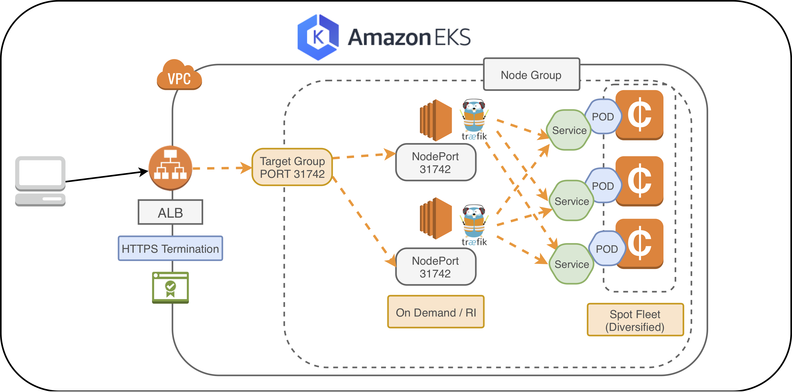
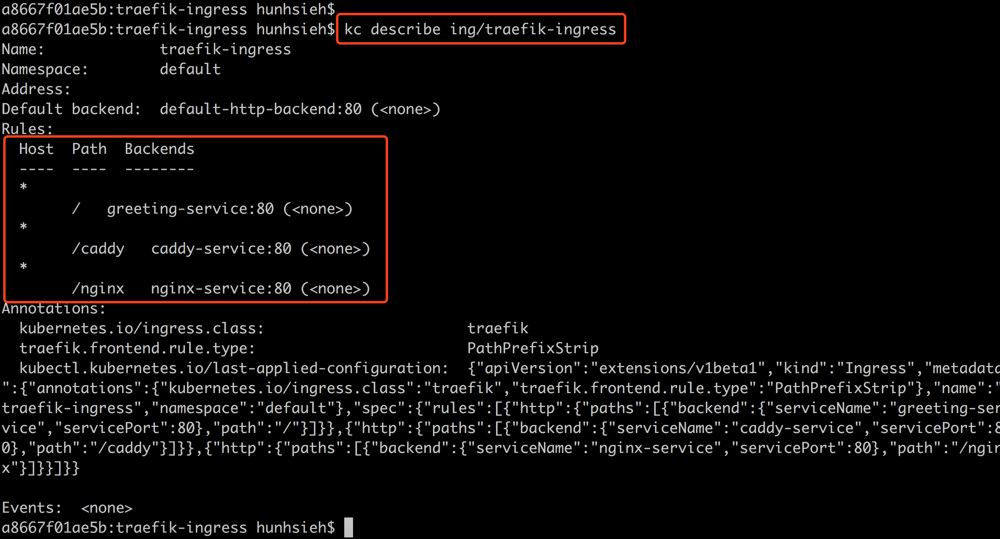
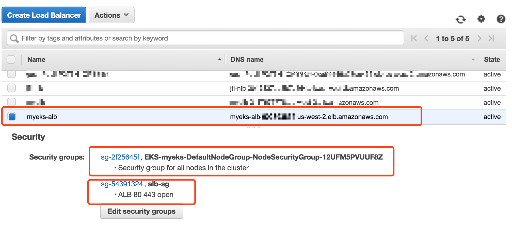
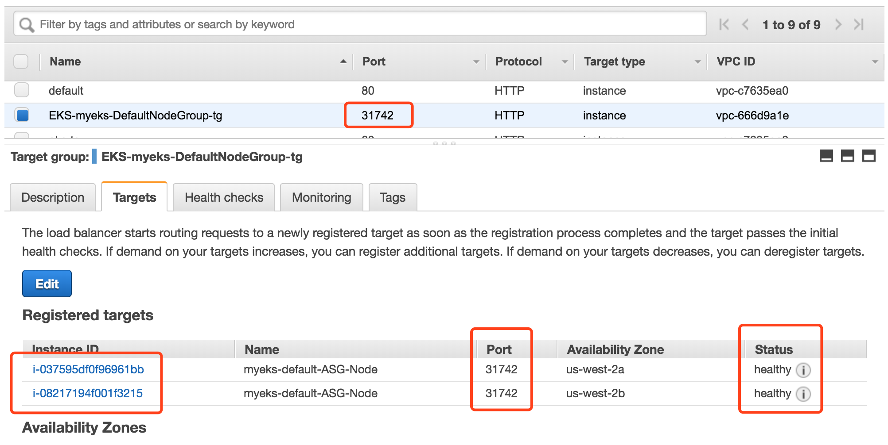
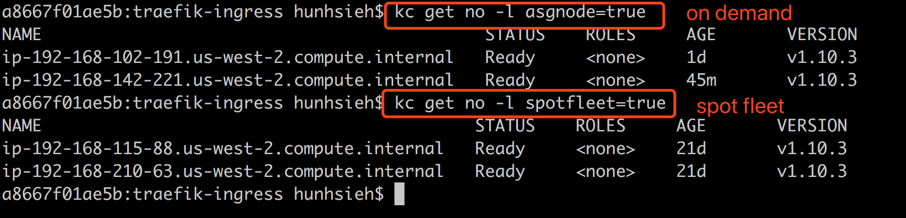
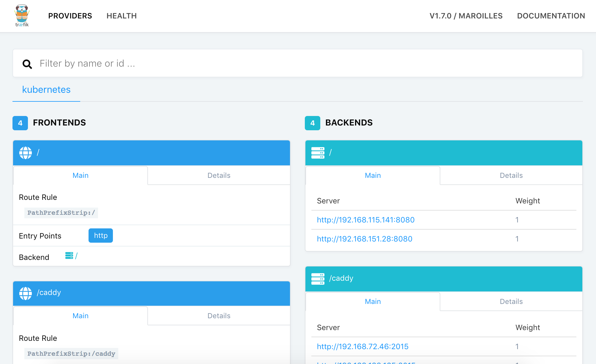
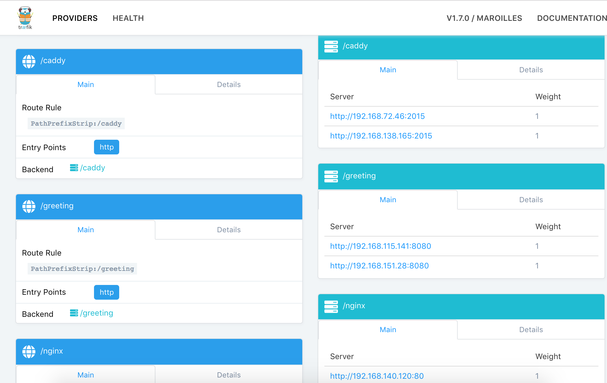
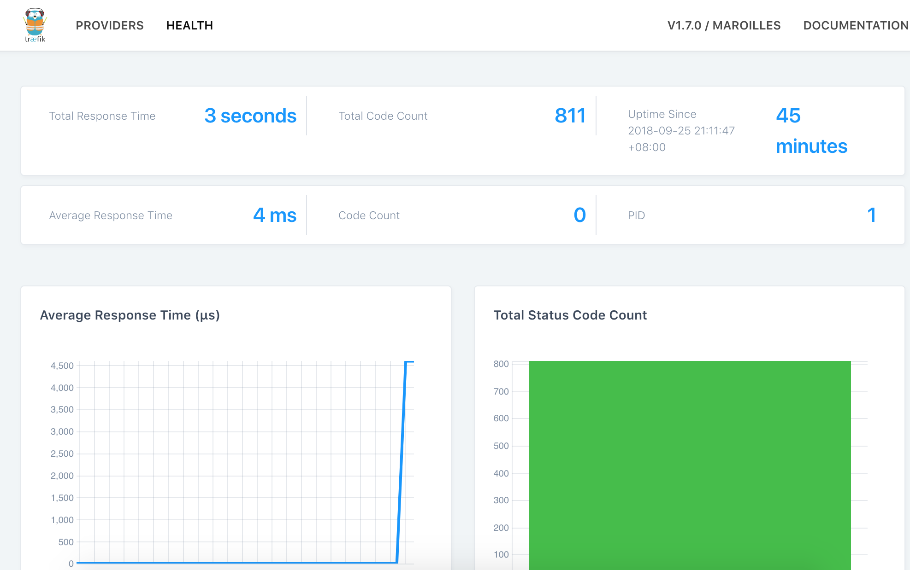

# Traefik ingress with Amazon EKS

This guide will walk you through building a Amazon EKS cluster with Traefik Ingress with `ALB` for HTTPS termionation. 





1. Create Amazon EKS cluster with `eksctl` - https://github.com/pahud/amazon-eks-workshop/blob/master/00-getting-started/create-eks-with-eksctl.md

2. Update your NodeGroup with this cloudformation template - https://github.com/pahud/amazon-eks-workshop/blob/master/01-nodegroup/customize-nodegroup.md. (This will also create a `Target Group` and `AutoScaling Group` registering to this Target Group on port `31742`, on which we will spin up our `Traefik Ingress Service` to listen and expose as `NodePort` service type.)

3. `kubectl apply` all the yaml in this folder:

   ```
   $ cd traefik-ingress
   $ kubectl apply -f .
   service "greeting-service" created
   deployment.extensions "greeting" created
   service "caddy-service" created
   deployment.extensions "caddy" created
   service "nginx-service" created
   deployment.extensions "nginx" created
   serviceaccount "ingress" created
   clusterrolebinding.rbac.authorization.k8s.io "ingress" created
   ingress.extensions "traefik-ingress" created
   service "traefik-ingress-lb-svc" created
   daemonset.extensions "traefik-ingress-lb" created
   ```

4. `kubectl get svc` to list all the services make sure `caddy-service`, `greeting-service` and `nginx-service` are running

5. `kubectl get ing` and make your `traefik-ingress` is running

6. `kubectl get svc -n kube-system` and make sure `traefik-ingress-lb-svc` is running on `NodePort` `31742` mapping to container port `80`


Describe the ingress and make sure the ingress rules exist




Create an `ALB` manually and make sure to associate it with two security groups:

1) The EKS nodegroup securigy group - so ALB can access any port for health check on the nodes

2) HTTP 80 and HTTPS 443 public open to all



And create a HTTP listener with a forwarding rule to the `Target Group` on Port `31742`




You should be able to see all the EC2 instances registered to this target group become status `healthy`.


## Validate


```
$ curl -s http://<ALB_DNS_NAME>/caddy| grep title | head -n1
<title>Caddy</title>

$ curl -s http://<ALB_DNS_NAME>/nginx | grep title | head -n1
<title>Welcome to nginx!</title>

$ curl -s http://<ALB_DNS_NAME>/?name=pahud
Hello pahud
```


## Traefik Ingerss Controller running on onDemand EC2

In your hybrid Amazon EKS nodegroup, your ondemand instances may have a label `asgnode=true` and spot instances with a label `spotfleet=true`. You can get them like this:




In `traefik-ingress-lb.yaml` we have a `nodeSelector` as below to restrict the traefik ingress controller will only run as `DaemonSet` on `on demand` instances managed by autoscaling group.

```
nodeSelector:
  asgnode: "true"
```


Get all the `traefik ingress controller` pods. Please note they only run on `on demand` instances.

```
$ kubectl get po -n kube-system -l name=traefik-ingress-lb -o wide
NAME                       READY     STATUS    RESTARTS   AGE       IP                NODE
traefik-ingress-lb-4djwc   1/1       Running   0          15m       192.168.102.191   ip-192-168-102-191.us-west-2.compute.internal
traefik-ingress-lb-x9lts   1/1       Running   0          15m       192.168.142.221   ip-192-168-142-221.us-west-2.compute.internal
```


## Traefik admin dashboard

Get the 1st Pod of traefik ingress controller
```
podName=$(kubectl -n kube-system get po -l name=traefik-ingress-lb -o jsonpath='{.items[0].metadata.name}')

```

And check the value of the podName 
```
$ echo $podName
traefik-ingress-lb-9pc2w
```
(your podName may have different suffix)


Create a port-forward from localhost:8580 into the pod:8580

```
$ kubectl -n kube-system port-forward pod/$podName 8580:8580
Forwarding from 127.0.0.1:8580 -> 8580
Forwarding from [::1]:8580 -> 8580
Handling connection for 8580
```

Open http://localhost:8580 from your local browser and you got the dashboard now!










## Clean up


```
$ cd traefik-ingress
$ kubectl delete -f .
service "greeting-service" deleted
deployment.extensions "greeting" deleted
service "caddy-service" deleted
deployment.extensions "caddy" deleted
service "nginx-service" deleted
deployment.extensions "nginx" deleted
serviceaccount "ingress" deleted
clusterrolebinding.rbac.authorization.k8s.io "ingress" deleted
ingress.extensions "traefik-ingress" deleted
service "traefik-ingress-lb-svc" deleted
daemonset.extensions "traefik-ingress-lb" deleted
```


