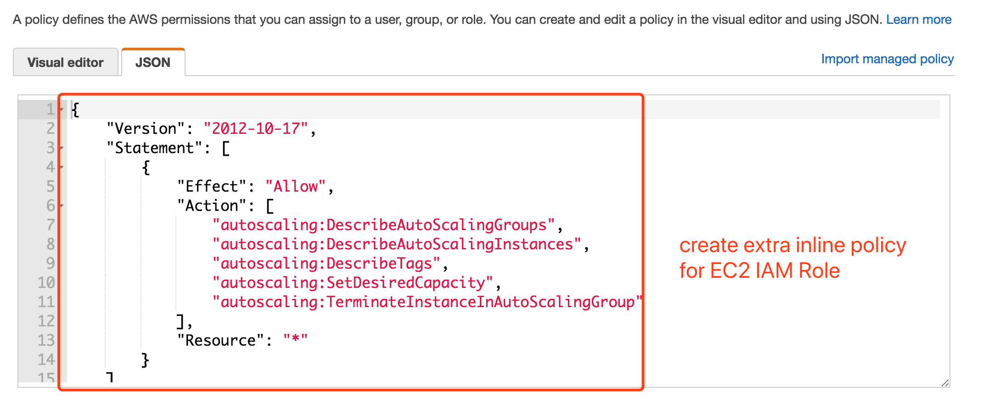
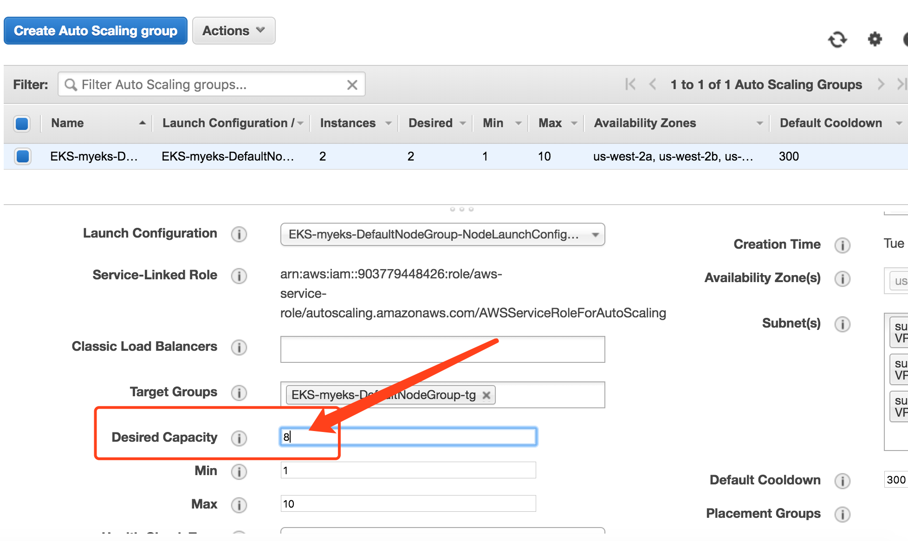
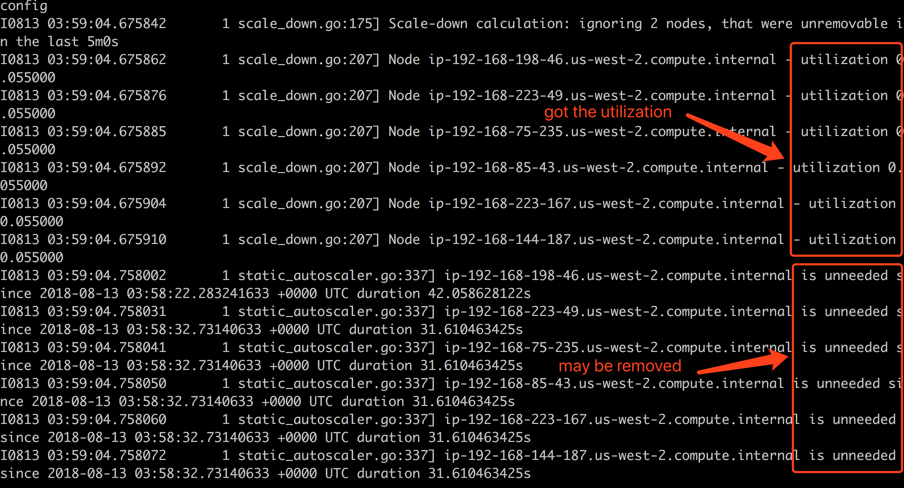
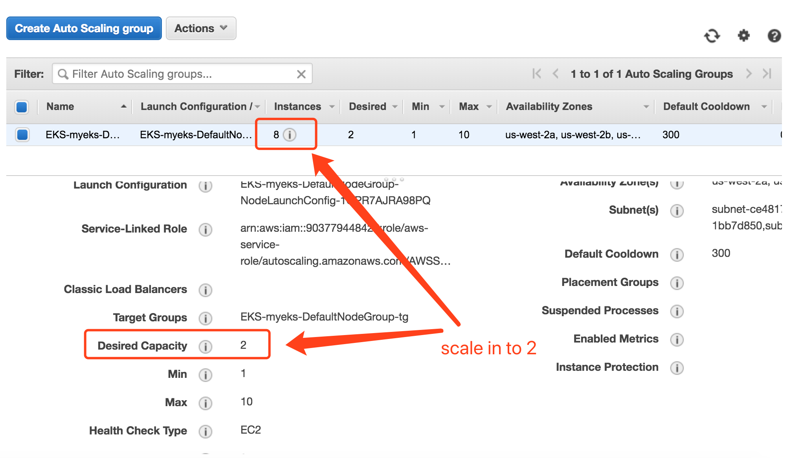
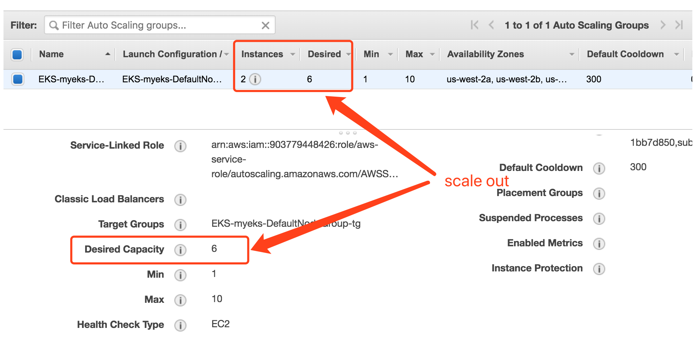

## cluster-autoscaler on Amazon EKS

This guide walks you through how to configure the **cluster-autoscaler** on **Amazon EKS**.


### Configuration 


edit `templates/eks-autoscaler.yaml` and specify the autoscaling group name in the `command` parameters.


For example:

```
          command:
            - ./cluster-autoscaler
            - --v=4
            - --stderrthreshold=info
            - --cloud-provider=aws
            - --skip-nodes-with-local-storage=false
            - --nodes=2:8:EKS-myeks-DefaultNodeGroup-NodeGroup-1CXC7XVC6QY2K
```

This will specify the `min` as `2` and `max` to `8` on the `EKS-myeks-DefaultNodeGroup-NodeGroup-1CXC7XVC6QY2K` autoscaling group. You need to modify them for your own environment.


#### Inline Policy for EC2 IAM Role

Attach extra IAM inline policy(**template/asg-policy.json**) to the EC2 IAM role.




### Apply the YAML 


```
$ kubectl apply -f templates/eks-autoscaler.yaml
serviceaccount "cluster-autoscaler" created
clusterrole.rbac.authorization.k8s.io "cluster-autoscaler" created
role.rbac.authorization.k8s.io "cluster-autoscaler" created
clusterrolebinding.rbac.authorization.k8s.io "cluster-autoscaler" created
rolebinding.rbac.authorization.k8s.io "cluster-autoscaler" created
deployment.extensions "cluster-autoscaler" created

```


### Watch the Logs

```
$ kubectl logs -f deployment/cluster-autoscaler -n kube-system
```

And you should be able to see the log flowing like below


```
I0813 03:49:10.992856       1 flags.go:52] FLAG: --address=":8085"
I0813 03:49:10.992900       1 flags.go:52] FLAG: --alsologtostderr="false"
I0813 03:49:10.992905       1 flags.go:52] FLAG: --application-metrics-count-limit="100"
I0813 03:49:10.992908       1 flags.go:52] FLAG: --azure-container-registry-config=""
I0813 03:49:10.992919       1 flags.go:52] FLAG: --balance-similar-node-groups="false"
I0813 03:49:10.992922       1 flags.go:52] FLAG: --boot-id-file="/proc/sys/kernel/random/boot_id"
I0813 03:49:10.992925       1 flags.go:52] FLAG: --cloud-config=""
I0813 03:49:10.992929       1 flags.go:52] FLAG: --cloud-provider="aws"
I0813 03:49:10.992932       1 flags.go:52] FLAG: --cloud-provider-gce-lb-src-cidrs="130.211.0.0/22,209.85.152.0/22,209.85.204.0/22,35.191.0.0/16"
I0813 03:49:10.992938       1 flags.go:52] FLAG: --cluster-name=""
I0813 03:49:10.992941       1 flags.go:52] FLAG: --configmap=""
I0813 03:49:10.992949       1 flags.go:52] FLAG: --container-hints="/etc/cadvisor/container_hints.json"
I0813 03:49:10.992952       1 flags.go:52] FLAG: --containerd="unix:///var/run/containerd.sock"
I0813 03:49:10.992956       1 flags.go:52] FLAG: --cores-total="0:320000"
I0813 03:49:10.992959       1 flags.go:52] FLAG: --docker="unix:///var/run/docker.sock"
I0813 03:49:10.992963       1 flags.go:52] FLAG: --docker-env-metadata-whitelist=""
I0813 03:49:10.992966       1 flags.go:52] FLAG: --docker-only="false"
I0813 03:49:10.992969       1 flags.go:52] FLAG: --docker-root="/var/lib/docker"
I0813 03:49:10.992972       1 flags.go:52] FLAG: --docker-tls="false"
I0813 03:49:10.992975       1 flags.go:52] FLAG: --docker-tls-ca="ca.pem"
I0813 03:49:10.992978       1 flags.go:52] FLAG: --docker-tls-cert="cert.pem"
I0813 03:49:10.992981       1 flags.go:52] FLAG: --docker-tls-key="key.pem"
I0813 03:49:10.992984       1 flags.go:52] FLAG: --enable-load-reader="false"
I0813 03:49:10.992987       1 flags.go:52] FLAG: --estimator="binpacking"
I0813 03:49:10.992990       1 flags.go:52] FLAG: --event-storage-age-limit="default=0"
I0813 03:49:10.992993       1 flags.go:52] FLAG: --event-storage-event-limit="default=0"
I0813 03:49:10.992996       1 flags.go:52] FLAG: --expander="random"
I0813 03:49:10.993000       1 flags.go:52] FLAG: --expendable-pods-priority-cutoff="0"
I0813 03:49:10.993003       1 flags.go:52] FLAG: --gke-api-endpoint=""
I0813 03:49:10.993006       1 flags.go:52] FLAG: --global-housekeeping-interval="1m0s"
I0813 03:49:10.993011       1 flags.go:52] FLAG: --google-json-key=""
I0813 03:49:10.993014       1 flags.go:52] FLAG: --housekeeping-interval="10s"
I0813 03:49:10.993018       1 flags.go:52] FLAG: --httptest.serve=""
I0813 03:49:10.993023       1 flags.go:52] FLAG: --kubeconfig=""
I0813 03:49:10.993026       1 flags.go:52] FLAG: --kubernetes=""
I0813 03:49:10.993031       1 flags.go:52] FLAG: --leader-elect="true"
I0813 03:49:10.993040       1 flags.go:52] FLAG: --leader-elect-lease-duration="15s"
I0813 03:49:10.993045       1 flags.go:52] FLAG: --leader-elect-renew-deadline="10s"
I0813 03:49:10.993049       1 flags.go:52] FLAG: --leader-elect-resource-lock="endpoints"
I0813 03:49:10.993055       1 flags.go:52] FLAG: --leader-elect-retry-period="2s"
I0813 03:49:10.993058       1 flags.go:52] FLAG: --log-backtrace-at=":0"
I0813 03:49:10.993065       1 flags.go:52] FLAG: --log-cadvisor-usage="false"
I0813 03:49:10.993069       1 flags.go:52] FLAG: --log-dir=""
I0813 03:49:10.993074       1 flags.go:52] FLAG: --log-flush-frequency="5s"
I0813 03:49:10.993077       1 flags.go:52] FLAG: --logtostderr="true"
I0813 03:49:10.993081       1 flags.go:52] FLAG: --machine-id-file="/etc/machine-id,/var/lib/dbus/machine-id"
I0813 03:49:10.993087       1 flags.go:52] FLAG: --max-autoprovisioned-node-group-count="15"
I0813 03:49:10.993090       1 flags.go:52] FLAG: --max-empty-bulk-delete="10"
I0813 03:49:10.993095       1 flags.go:52] FLAG: --max-failing-time="15m0s"
I0813 03:49:10.993098       1 flags.go:52] FLAG: --max-graceful-termination-sec="600"
I0813 03:49:10.993104       1 flags.go:52] FLAG: --max-inactivity="10m0s"
I0813 03:49:10.993107       1 flags.go:52] FLAG: --max-node-provision-time="15m0s"
I0813 03:49:10.993110       1 flags.go:52] FLAG: --max-nodes-total="0"
I0813 03:49:10.993113       1 flags.go:52] FLAG: --max-total-unready-percentage="45"
I0813 03:49:10.993117       1 flags.go:52] FLAG: --memory-total="0:6400000"
I0813 03:49:10.993120       1 flags.go:52] FLAG: --min-replica-count="0"
I0813 03:49:10.993125       1 flags.go:52] FLAG: --namespace="kube-system"
I0813 03:49:10.993128       1 flags.go:52] FLAG: --node-autoprovisioning-enabled="false"
I0813 03:49:10.993132       1 flags.go:52] FLAG: --node-group-auto-discovery="[]"
I0813 03:49:10.993135       1 flags.go:52] FLAG: --nodes="[2:8:EKS-myeks-DefaultNodeGroup-NodeGroup-1CXC7XVC6QY2K]"
I0813 03:49:10.993139       1 flags.go:52] FLAG: --ok-total-unready-count="3"
I0813 03:49:10.993142       1 flags.go:52] FLAG: --regional="false"
I0813 03:49:10.993147       1 flags.go:52] FLAG: --scale-down-candidates-pool-min-count="50"
I0813 03:49:10.993150       1 flags.go:52] FLAG: --scale-down-candidates-pool-ratio="0.1"
I0813 03:49:10.993156       1 flags.go:52] FLAG: --scale-down-delay-after-add="10m0s"
I0813 03:49:10.993159       1 flags.go:52] FLAG: --scale-down-delay-after-delete="10s"
I0813 03:49:10.993163       1 flags.go:52] FLAG: --scale-down-delay-after-failure="3m0s"
I0813 03:49:10.993166       1 flags.go:52] FLAG: --scale-down-enabled="true"
I0813 03:49:10.993169       1 flags.go:52] FLAG: --scale-down-non-empty-candidates-count="30"
I0813 03:49:10.993172       1 flags.go:52] FLAG: --scale-down-unneeded-time="10m0s"
I0813 03:49:10.993175       1 flags.go:52] FLAG: --scale-down-unready-time="20m0s"
I0813 03:49:10.993178       1 flags.go:52] FLAG: --scale-down-utilization-threshold="0.5"
I0813 03:49:10.993181       1 flags.go:52] FLAG: --scan-interval="10s"
I0813 03:49:10.993184       1 flags.go:52] FLAG: --skip-nodes-with-local-storage="false"
I0813 03:49:10.993187       1 flags.go:52] FLAG: --skip-nodes-with-system-pods="true"
I0813 03:49:10.993190       1 flags.go:52] FLAG: --stderrthreshold="0"
I0813 03:49:10.993193       1 flags.go:52] FLAG: --storage-driver-buffer-duration="1m0s"
I0813 03:49:10.993196       1 flags.go:52] FLAG: --storage-driver-db="cadvisor"
I0813 03:49:10.993199       1 flags.go:52] FLAG: --storage-driver-host="localhost:8086"
I0813 03:49:10.993202       1 flags.go:52] FLAG: --storage-driver-password="root"
I0813 03:49:10.993205       1 flags.go:52] FLAG: --storage-driver-secure="false"
I0813 03:49:10.993208       1 flags.go:52] FLAG: --storage-driver-table="stats"
I0813 03:49:10.993211       1 flags.go:52] FLAG: --storage-driver-user="root"
I0813 03:49:10.993213       1 flags.go:52] FLAG: --test.bench=""
I0813 03:49:10.993216       1 flags.go:52] FLAG: --test.benchmem="false"
I0813 03:49:10.993219       1 flags.go:52] FLAG: --test.benchtime="1s"
I0813 03:49:10.993222       1 flags.go:52] FLAG: --test.blockprofile=""
I0813 03:49:10.993225       1 flags.go:52] FLAG: --test.blockprofilerate="1"
I0813 03:49:10.993228       1 flags.go:52] FLAG: --test.count="1"
I0813 03:49:10.993231       1 flags.go:52] FLAG: --test.coverprofile=""
I0813 03:49:10.993234       1 flags.go:52] FLAG: --test.cpu=""
I0813 03:49:10.993237       1 flags.go:52] FLAG: --test.cpuprofile=""
I0813 03:49:10.993243       1 flags.go:52] FLAG: --test.memprofile=""
I0813 03:49:10.993246       1 flags.go:52] FLAG: --test.memprofilerate="0"
I0813 03:49:10.993249       1 flags.go:52] FLAG: --test.mutexprofile=""
I0813 03:49:10.993252       1 flags.go:52] FLAG: --test.mutexprofilefraction="1"
I0813 03:49:10.993255       1 flags.go:52] FLAG: --test.outputdir=""
I0813 03:49:10.993257       1 flags.go:52] FLAG: --test.parallel="2"
I0813 03:49:10.993260       1 flags.go:52] FLAG: --test.run=""
I0813 03:49:10.993263       1 flags.go:52] FLAG: --test.short="false"
I0813 03:49:10.993266       1 flags.go:52] FLAG: --test.timeout="0s"
I0813 03:49:10.993269       1 flags.go:52] FLAG: --test.trace=""
I0813 03:49:10.993272       1 flags.go:52] FLAG: --test.v="false"
I0813 03:49:10.993275       1 flags.go:52] FLAG: --v="4"
I0813 03:49:10.993278       1 flags.go:52] FLAG: --version="false"
I0813 03:49:10.993284       1 flags.go:52] FLAG: --vmodule=""
I0813 03:49:10.993287       1 flags.go:52] FLAG: --write-status-configmap="true"
I0813 03:49:10.993293       1 main.go:298] Cluster Autoscaler 1.2.2
I0813 03:49:11.107635       1 leaderelection.go:175] attempting to acquire leader lease  kube-system/cluster-autoscaler...
I0813 03:49:11.112799       1 leaderelection.go:243] lock is held by cluster-autoscaler-5c4c96764b-2q25v and has not yet expired
I0813 03:49:11.112815       1 leaderelection.go:180] failed to acquire lease kube-system/cluster-autoscaler
I0813 03:49:13.552811       1 leaderelection.go:243] lock is held by cluster-autoscaler-5c4c96764b-2q25v and has not yet expired
I0813 03:49:13.552935       1 leaderelection.go:180] failed to acquire lease kube-system/cluster-autoscaler
I0813 03:49:16.484256       1 leaderelection.go:243] lock is held by cluster-autoscaler-5c4c96764b-2q25v and has not yet expired
I0813 03:49:16.484275       1 leaderelection.go:180] failed to acquire lease kube-system/cluster-autoscaler
I0813 03:49:19.483446       1 leaderelection.go:243] lock is held by cluster-autoscaler-5c4c96764b-2q25v and has not yet expired
I0813 03:49:19.483467       1 leaderelection.go:180] failed to acquire lease kube-system/cluster-autoscaler
I0813 03:49:22.010573       1 leaderelection.go:243] lock is held by cluster-autoscaler-5c4c96764b-2q25v and has not yet expired
I0813 03:49:22.010598       1 leaderelection.go:180] failed to acquire lease kube-system/cluster-autoscaler
I0813 03:49:25.331903       1 leaderelection.go:243] lock is held by cluster-autoscaler-5c4c96764b-2q25v and has not yet expired
I0813 03:49:25.331916       1 leaderelection.go:180] failed to acquire lease kube-system/cluster-autoscaler
I0813 03:49:29.426059       1 leaderelection.go:184] successfully acquired lease kube-system/cluster-autoscaler
I0813 03:49:29.486473       1 predicates.go:125] Using predicate PodFitsResources
I0813 03:49:29.486568       1 predicates.go:125] Using predicate GeneralPredicates
I0813 03:49:29.486591       1 predicates.go:125] Using predicate PodToleratesNodeTaints
I0813 03:49:29.486611       1 predicates.go:125] Using predicate CheckNodeMemoryPressure
I0813 03:49:29.486629       1 predicates.go:125] Using predicate ready
I0813 03:49:29.486647       1 predicates.go:125] Using predicate CheckNodeDiskPressure
I0813 03:49:29.486761       1 predicates.go:125] Using predicate CheckVolumeBinding
I0813 03:49:29.486794       1 predicates.go:125] Using predicate MaxAzureDiskVolumeCount
I0813 03:49:29.486814       1 predicates.go:125] Using predicate NoDiskConflict
I0813 03:49:29.486833       1 predicates.go:125] Using predicate CheckNodeCondition
I0813 03:49:29.486851       1 predicates.go:125] Using predicate MaxGCEPDVolumeCount
I0813 03:49:29.486869       1 predicates.go:125] Using predicate MatchInterPodAffinity
I0813 03:49:29.486887       1 predicates.go:125] Using predicate MaxEBSVolumeCount
I0813 03:49:29.486974       1 predicates.go:125] Using predicate NoVolumeZoneConflict
I0813 03:49:29.487448       1 reflector.go:202] Starting reflector *v1beta1.DaemonSet (1h0m0s) from k8s.io/autoscaler/cluster-autoscaler/utils/kubernetes/listers.go:293
I0813 03:49:29.487499       1 reflector.go:240] Listing and watching *v1beta1.DaemonSet from k8s.io/autoscaler/cluster-autoscaler/utils/kubernetes/listers.go:293
I0813 03:49:29.488145       1 reflector.go:202] Starting reflector *v1beta1.StatefulSet (0s) from k8s.io/autoscaler/cluster-autoscaler/vendor/k8s.io/client-go/informers/factory.go:87
I0813 03:49:29.488186       1 reflector.go:240] Listing and watching *v1beta1.StatefulSet from k8s.io/autoscaler/cluster-autoscaler/vendor/k8s.io/client-go/informers/factory.go:87
I0813 03:49:29.488389       1 factory.go:33] Event(v1.ObjectReference{Kind:"Endpoints", Namespace:"kube-system", Name:"cluster-autoscaler", UID:"e9498bdb-9e9c-11e8-b9d7-06a77e9e2ace", APIVersion:"v1", ResourceVersion:"2904872", FieldPath:""}): type: 'Normal' reason: 'LeaderElection' cluster-autoscaler-5c4c96764b-c4mnk became leader
I0813 03:49:29.488931       1 reflector.go:202] Starting reflector *v1.Pod (1h0m0s) from k8s.io/autoscaler/cluster-autoscaler/utils/kubernetes/listers.go:149
I0813 03:49:29.488958       1 reflector.go:240] Listing and watching *v1.Pod from k8s.io/autoscaler/cluster-autoscaler/utils/kubernetes/listers.go:149
I0813 03:49:29.489405       1 reflector.go:202] Starting reflector *v1.PersistentVolumeClaim (0s) from k8s.io/autoscaler/cluster-autoscaler/vendor/k8s.io/client-go/informers/factory.go:87
I0813 03:49:29.489421       1 reflector.go:240] Listing and watching *v1.PersistentVolumeClaim from k8s.io/autoscaler/cluster-autoscaler/vendor/k8s.io/client-go/informers/factory.go:87
I0813 03:49:29.489896       1 reflector.go:202] Starting reflector *v1.Service (0s) from k8s.io/autoscaler/cluster-autoscaler/vendor/k8s.io/client-go/informers/factory.go:87
I0813 03:49:29.489914       1 reflector.go:240] Listing and watching *v1.Service from k8s.io/autoscaler/cluster-autoscaler/vendor/k8s.io/client-go/informers/factory.go:87
I0813 03:49:29.490436       1 reflector.go:202] Starting reflector *v1beta1.PodDisruptionBudget (0s) from k8s.io/autoscaler/cluster-autoscaler/vendor/k8s.io/client-go/informers/factory.go:87
I0813 03:49:29.490454       1 reflector.go:240] Listing and watching *v1beta1.PodDisruptionBudget from k8s.io/autoscaler/cluster-autoscaler/vendor/k8s.io/client-go/informers/factory.go:87
I0813 03:49:29.583446       1 reflector.go:202] Starting reflector *v1.Pod (1h0m0s) from k8s.io/autoscaler/cluster-autoscaler/utils/kubernetes/listers.go:174
I0813 03:49:29.583493       1 reflector.go:240] Listing and watching *v1.Pod from k8s.io/autoscaler/cluster-autoscaler/utils/kubernetes/listers.go:174
I0813 03:49:29.583761       1 reflector.go:202] Starting reflector *v1.Pod (0s) from k8s.io/autoscaler/cluster-autoscaler/vendor/k8s.io/client-go/informers/factory.go:87
I0813 03:49:29.583800       1 reflector.go:240] Listing and watching *v1.Pod from k8s.io/autoscaler/cluster-autoscaler/vendor/k8s.io/client-go/informers/factory.go:87
I0813 03:49:29.583807       1 reflector.go:202] Starting reflector *v1.Node (1h0m0s) from k8s.io/autoscaler/cluster-autoscaler/utils/kubernetes/listers.go:212
I0813 03:49:29.583838       1 reflector.go:240] Listing and watching *v1.Node from k8s.io/autoscaler/cluster-autoscaler/utils/kubernetes/listers.go:212
I0813 03:49:29.583972       1 reflector.go:202] Starting reflector *v1.Node (1h0m0s) from k8s.io/autoscaler/cluster-autoscaler/utils/kubernetes/listers.go:239
I0813 03:49:29.583985       1 reflector.go:240] Listing and watching *v1.Node from k8s.io/autoscaler/cluster-autoscaler/utils/kubernetes/listers.go:239
I0813 03:49:29.584115       1 reflector.go:202] Starting reflector *v1beta1.PodDisruptionBudget (1h0m0s) from k8s.io/autoscaler/cluster-autoscaler/utils/kubernetes/listers.go:266
I0813 03:49:29.584128       1 reflector.go:240] Listing and watching *v1beta1.PodDisruptionBudget from k8s.io/autoscaler/cluster-autoscaler/utils/kubernetes/listers.go:266
I0813 03:49:29.584186       1 reflector.go:202] Starting reflector *v1.Node (0s) from k8s.io/autoscaler/cluster-autoscaler/vendor/k8s.io/client-go/informers/factory.go:87
I0813 03:49:29.584211       1 reflector.go:240] Listing and watching *v1.Node from k8s.io/autoscaler/cluster-autoscaler/vendor/k8s.io/client-go/informers/factory.go:87
I0813 03:49:29.584358       1 reflector.go:202] Starting reflector *v1.PersistentVolume (0s) from k8s.io/autoscaler/cluster-autoscaler/vendor/k8s.io/client-go/informers/factory.go:87
I0813 03:49:29.584367       1 reflector.go:240] Listing and watching *v1.PersistentVolume from k8s.io/autoscaler/cluster-autoscaler/vendor/k8s.io/client-go/informers/factory.go:87
I0813 03:49:29.584544       1 reflector.go:202] Starting reflector *v1.StorageClass (0s) from k8s.io/autoscaler/cluster-autoscaler/vendor/k8s.io/client-go/informers/factory.go:87
I0813 03:49:29.584579       1 reflector.go:240] Listing and watching *v1.StorageClass from k8s.io/autoscaler/cluster-autoscaler/vendor/k8s.io/client-go/informers/factory.go:87
I0813 03:49:29.584897       1 reflector.go:202] Starting reflector *v1.ReplicationController (0s) from k8s.io/autoscaler/cluster-autoscaler/vendor/k8s.io/client-go/informers/factory.go:87
I0813 03:49:29.584933       1 reflector.go:240] Listing and watching *v1.ReplicationController from k8s.io/autoscaler/cluster-autoscaler/vendor/k8s.io/client-go/informers/factory.go:87
I0813 03:49:29.585221       1 reflector.go:202] Starting reflector *v1beta1.ReplicaSet (0s) from k8s.io/autoscaler/cluster-autoscaler/vendor/k8s.io/client-go/informers/factory.go:87
I0813 03:49:29.585258       1 reflector.go:240] Listing and watching *v1beta1.ReplicaSet from k8s.io/autoscaler/cluster-autoscaler/vendor/k8s.io/client-go/informers/factory.go:87
I0813 03:49:29.883414       1 request.go:481] Throttling request took 298.392935ms, request: GET:https://10.100.0.1:443/api/v1/replicationcontrollers?limit=500&resourceVersion=0
I0813 03:49:29.987158       1 request.go:481] Throttling request took 302.321948ms, request: PUT:https://10.100.0.1:443/api/v1/namespaces/kube-system/configmaps/cluster-autoscaler-status
I0813 03:49:30.784426       1 cloud_provider_builder.go:72] Building aws cloud provider.
I0813 03:49:30.784493       1 auto_scaling_groups.go:78] Registering ASG EKS-myeks-DefaultNodeGroup-NodeGroup-1CXC7XVC6QY2K
I0813 03:49:30.784499       1 auto_scaling_groups.go:139] Invalidating unowned instance cache
I0813 03:49:30.784506       1 auto_scaling_groups.go:153] Regenerating instance to ASG map for ASGs: [EKS-myeks-DefaultNodeGroup-NodeGroup-1CXC7XVC6QY2K]
I0813 03:49:31.493708       1 leaderelection.go:199] successfully renewed lease kube-system/cluster-autoscaler
I0813 03:49:31.794961       1 aws_manager.go:241] Refreshed ASG list, next refresh after 2018-08-13 03:50:31.79495307 +0000 UTC
I0813 03:49:31.795148       1 auto_scaling_groups.go:153] Regenerating instance to ASG map for ASGs: [EKS-myeks-DefaultNodeGroup-NodeGroup-1CXC7XVC6QY2K]
I0813 03:49:31.812340       1 main.go:228] Registered cleanup signal handler
I0813 03:49:33.515802       1 leaderelection.go:199] successfully renewed lease kube-system/cluster-autoscaler
I0813 03:49:35.525411       1 leaderelection.go:199] successfully renewed lease kube-system/cluster-autoscaler
I0813 03:49:37.537171       1 leaderelection.go:199] successfully renewed lease kube-system/cluster-autoscaler
I0813 03:49:39.583447       1 leaderelection.go:199] successfully renewed lease kube-system/cluster-autoscaler
I0813 03:49:41.690556       1 leaderelection.go:199] successfully renewed lease kube-system/cluster-autoscaler
```


### Validation for Scale In

You can manually increase the number of `desired` capacity (e.g. 8 in the example below).




And the `cluster-autoscaler` will probe the resource utilization and determine if the instances are unneeded and may be removed(scale in)




And overtime, the caluster-autoscaler will detect them and scale down the capacity and remove nodes being undeeded for `10 minutes`




### Validation for Scale out


Let's create a deployment of Nginx with a replicaset of `1 Pod`

```
$ kubectl apply -f templates/nginx-to-scaleout.yaml
deployment.extensions "nginx-to-scaleout" created

$ kubectl get deployment/nginx-to-scaleout
NAME                DESIRED   CURRENT   UP-TO-DATE   AVAILABLE   AGE
nginx-to-scaleout   1         1         1            1           8s
```


OK, let's scale out the replicaset to `20`

```
$ kubectl get deployment/nginx-to-scaleout
NAME                DESIRED   CURRENT   UP-TO-DATE   AVAILABLE   AGE
nginx-to-scaleout   20        20        20           7           2m
```


Some `pods` will be in the `Pending` state, which triggers the `cluster-autoscaler` to scale out the EC2 fleet.

```
$ kubectl get po
NAME                                 READY     STATUS    RESTARTS   AGE
nginx-to-scaleout-7cb554c7d5-56vgm   0/1       Pending   0          39s
nginx-to-scaleout-7cb554c7d5-7bjrd   1/1       Running   0          39s
nginx-to-scaleout-7cb554c7d5-cb986   1/1       Running   0          2m
nginx-to-scaleout-7cb554c7d5-f7qrr   0/1       Pending   0          39s
nginx-to-scaleout-7cb554c7d5-fzjds   0/1       Pending   0          39s
nginx-to-scaleout-7cb554c7d5-g8ldm   0/1       Pending   0          39s
nginx-to-scaleout-7cb554c7d5-gf4x7   1/1       Running   0          39s
nginx-to-scaleout-7cb554c7d5-gszwf   0/1       Pending   0          39s
nginx-to-scaleout-7cb554c7d5-hzjzd   0/1       Pending   0          39s
nginx-to-scaleout-7cb554c7d5-jtfcp   1/1       Running   0          39s
nginx-to-scaleout-7cb554c7d5-nzdvl   0/1       Pending   0          39s
nginx-to-scaleout-7cb554c7d5-nzp9v   0/1       Pending   0          39s
nginx-to-scaleout-7cb554c7d5-pqqtt   1/1       Running   0          39s
nginx-to-scaleout-7cb554c7d5-q2hvb   1/1       Running   0          39s
nginx-to-scaleout-7cb554c7d5-q6lzp   1/1       Running   0          39s
nginx-to-scaleout-7cb554c7d5-sgxhg   1/1       Running   0          39s
nginx-to-scaleout-7cb554c7d5-szgb6   0/1       Pending   0          39s
nginx-to-scaleout-7cb554c7d5-tp2kl   0/1       Pending   0          39s
nginx-to-scaleout-7cb554c7d5-wvbdp   0/1       Pending   0          39s
nginx-to-scaleout-7cb554c7d5-xk26j   0/1       Pending   0          39s
```

You will see the autoscaling group starts scaling out immediately.




## Clean up

```
$ kubectl delete -f templates/nginx-to-scaleout.yaml
deployment.extensions "nginx-to-scaleout" deleted

$ kubelctl delete -f templates/eks-autoscaler.yaml
serviceaccount "cluster-autoscaler" deleted
clusterrole.rbac.authorization.k8s.io "cluster-autoscaler" deleted
role.rbac.authorization.k8s.io "cluster-autoscaler" deleted
clusterrolebinding.rbac.authorization.k8s.io "cluster-autoscaler" deleted
rolebinding.rbac.authorization.k8s.io "cluster-autoscaler" deleted
deployment.extensions "cluster-autoscaler" deleted
```


## Reference and Further Reading

Cluster Autoscaler on AWS - https://github.com/kubernetes/autoscaler/blob/master/cluster-autoscaler/cloudprovider/aws/README.md

FAQ - https://github.com/kubernetes/autoscaler/blob/master/cluster-autoscaler/FAQ.md
