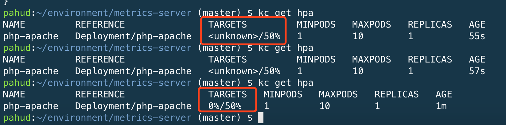
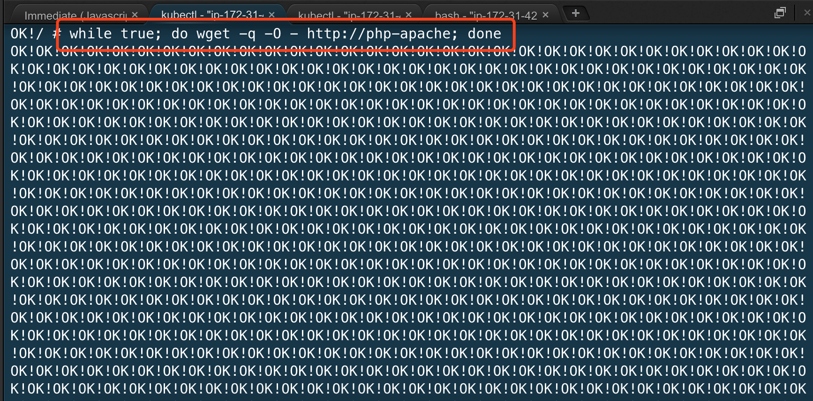
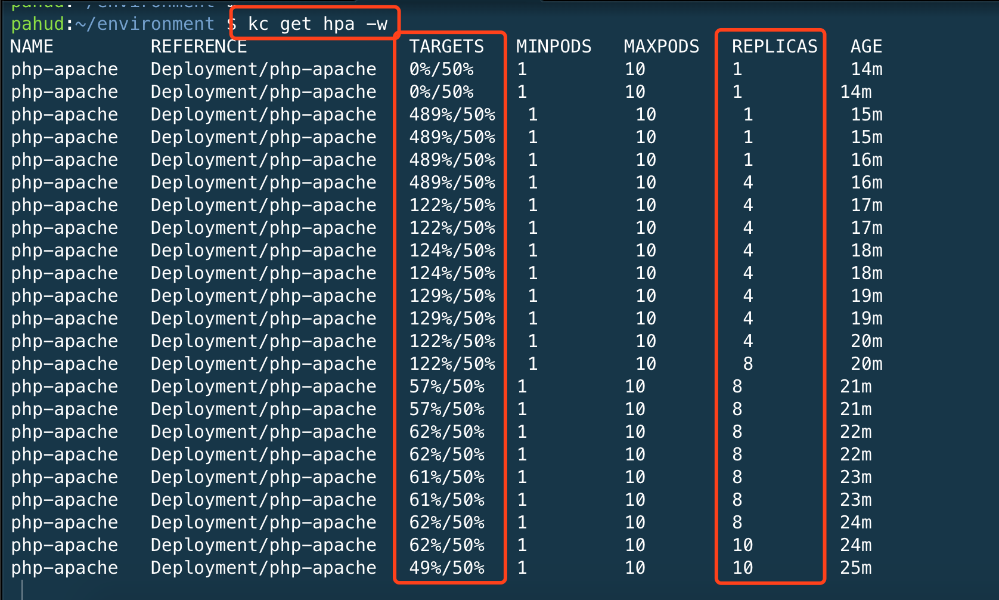

# HPA(Horizontal Pod Autoscaling)

### Prerequisities

[Create your Amazon EKS cluster with eksctl](https://github.com/pahud/amazon-eks-workshop/blob/master/00-getting-started/create-eks-with-eksctl.md)

[Customize your nodegroup(worker nodes)](https://github.com/pahud/amazon-eks-workshop/blob/master/01-nodegroup/customize-nodegroup.md) **make sure to use the latest EKS-optimized AMI(lookup the latest EKS-optimized AMI in [the doc](https://docs.aws.amazon.com/eks/latest/userguide/getting-started.html))* 

make sure your Amazon EKS cluster is **eks.2** platform ([platform versions](https://docs.aws.amazon.com/eks/latest/userguide/platform-versions.html))


### Install the metrics-server


git clone the metrics-server from https://github.com/kubernetes-incubator/metrics-server

```
$ kubectl apply -f deploy/1.8+/
clusterrolebinding.rbac.authorization.k8s.io "metrics-server:system:auth-delegator" created
rolebinding.rbac.authorization.k8s.io "metrics-server-auth-reader" created
apiservice.apiregistration.k8s.io "v1beta1.metrics.k8s.io" created
serviceaccount "metrics-server" created
deployment.extensions "metrics-server" created
service "metrics-server" created
clusterrole.rbac.authorization.k8s.io "system:metrics-server" created
clusterrolebinding.rbac.authorization.k8s.io "system:metrics-server" created
```


check `/apis/metrics.k8s.io/v1beta1/nodes` and make sure you receive the JSON response.

```
$ kubectl get --raw "/apis/metrics.k8s.io/v1beta1/nodes" | jq .
{
  "kind": "NodeMetricsList",
  "apiVersion": "metrics.k8s.io/v1beta1",
  "metadata": {
    "selfLink": "/apis/metrics.k8s.io/v1beta1/nodes"
  },
  "items": []
}
```


create an deployment and service

```
$ kubectl run php-apache --image=k8s.gcr.io/hpa-example --requests=cpu=200m --expose --port=80
service "php-apache" created
deployment.apps "php-apache" created
```


create HPA

```
$ kubectl autoscale deployment php-apache --cpu-percent=50 --min=1 --max=10
deployment.apps "php-apache" autoscaled
```

get the hpa

```
$ kubectl get hpa
```




You probably will see `<unknown>/50% ` for 1-2 minutes and then you should be able to see `0%/50%` like as above.


### Validation

Run a log-generator and execute a while loop to get `http://php-apache` like below

```
$ kubectl run -i --tty load-generator --image=busybox /bin/sh
If you don't see a command prompt, try pressing enter.
# while true; do wget -q -O - http://php-apache; done
OK!OK!OK!OK!OK!OK!OK!OK!OK!OK!OK!OK!OK!OK!OK!OK!OK!OK!OK!OK!OK!OK!OK!OK!OK!OK!OK!OK!OK!OK!OK!OK!OK!OK!OK!OK!OK!OK!OK!OK!OK!OK!OK!OK!OK!OK!OK!OK!OK!OK!OK!OK!OK!OK!OK!OK!OK!OK!OK!OK!OK!OK!OK!OK!OK!OK!OK!OK!OK!OK!OK!OK!OK!OK!OK!OK!OK!OK!OK!OK!OK!OK!OK!OK!OK!OK!OK!OK!OK!OK!OK!OK!OK!OK!
(you'll see a lot of OK! like above)
```




Leave this terminal running and open another terminal in Cloud9 and run

```
$ kubectl get hpa -w
```

Watch the screen and see how HPA scales the pods from 1 to 10 and eventually brings down the service loading under the targets(50%)




# Troubleshooting


## Metrics server resolution issue when using customzied domain-name in your VPC DHCP options set

In some case, if you've launched your EKS cluster in your own VPC with customized [DHCP options set](https://docs.aws.amazon.com/vpc/latest/userguide/VPC_DHCP_Options.html#DHCPOptionSets), which applied to your own domain-name setting (i.e. example.com). After you deployed the metrics server, you probably will find out the failure information and unable to get the metric information:

```bash
$ kubectl get all --namespace=kube-system

NAME                                  READY     STATUS    RESTARTS   AGE
pod/aws-node-9xktg                    1/1       Running   1          18m
pod/aws-node-mj95f                    1/1       Running   0          14m
pod/kube-dns-7cc87d595-8s9l6          3/3       Running   0          46m
pod/kube-proxy-rlhjm                  1/1       Running   0          14m
pod/kube-proxy-x5t6x                  1/1       Running   0          18m
pod/metrics-server-55b6ff4cb7-rp4bw   1/1       Running   0          3m
...


$ kubectl logs metrics-server-55b6ff4cb7-rp4bw --namespace=kube-system

I0912 03:21:28.933854       1 serving.go:273] Generated self-signed cert (apiserver.local.config/certificates/apiserver.crt, apiserver.local.config/certificates/apiserver.key)
W0912 03:21:29.624532       1 authentication.go:166] cluster doesn't provide client-ca-file in configmap/extension-apiserver-authentication in kube-system, so client certificate authentication to extension api-server won't work.
W0912 03:21:29.629836       1 authentication.go:210] cluster doesn't provide client-ca-file in configmap/extension-apiserver-authentication in kube-system, so client certificate authentication to extension api-server won't work.
[restful] 2018/09/12 03:21:29 log.go:33: [restful/swagger] listing is available at https://:443/swaggerapi
[restful] 2018/09/12 03:21:29 log.go:33: [restful/swagger] https://:443/swaggerui/ is mapped to folder /swagger-ui/
I0912 03:21:29.676485       1 serve.go:96] Serving securely on [::]:443
...
E0912 03:25:29.760003       1 manager.go:102] unable to fully collect metrics: [unable to fully scrape metrics from source kubelet_summary:ip-192-168-149-221.us-west-2.compute.internal: unable to fetch metrics from Kubelet ip-192-168-149-221.us-west-2.compute.internal (ip-192-168-149-221.example.com): Get https://ip-192-168-149-221.example.com:10250/stats/summary/: dial tcp: lookup ip-192-168-149-221.example.com on 10.100.0.10:53: no such host, unable to fully scrape metrics from source kubelet_summary:ip-192-168-225-105.us-west-2.compute.internal: unable to fetch metrics from Kubelet ip-192-168-225-105.us-west-2.compute.internal (ip-192-168-225-105.example.com): Get https://ip-192-168-225-105.example.com:10250/stats/summary/: dial tcp: lookup ip-192-168-225-105.example.com on 10.100.0.10:53: no such host]
```

If you try to use `kubectl top nodes` command, you may see the following error message:

```
$ kubectl top nodes

error: metrics not available yet
```

This issue is due to the hostname resolution is being performed through the internal DNS server (which is set by default to the pod where the metrics-server runs in). The customized domain-name is not in that scope so they can't be resolved via that DNS.

To fix this issue, you can update the deployment file of metrics server (`metrics-server/deply/1.8+/metrics-server-deployment.yaml`) by using internal IP address instead of the hostname to communicate with your nodes:

```yaml
command:
  - /metrics-server
  - --kubelet-insecure-tls
  - --kubelet-preferred-address-types=InternalIP
```

Here is an example applying the command above (You need to `+` when updating the deplyoment file):

```yaml
---
apiVersion: v1
kind: ServiceAccount
metadata:
name: metrics-server
namespace: kube-system
---
apiVersion: extensions/v1beta1
kind: Deployment
metadata:
name: metrics-server
namespace: kube-system
labels:
  k8s-app: metrics-server
spec:
selector:
  matchLabels:
    k8s-app: metrics-server
template:
  metadata:
    name: metrics-server
    labels:
      k8s-app: metrics-server
  spec:
    serviceAccountName: metrics-server
    volumes:
    # mount in tmp so we can safely use from-scratch images and/or read-only containers
    - name: tmp-dir
      emptyDir: {}
    containers:
    - name: metrics-server
      image: k8s.gcr.io/metrics-server-amd64:v0.3.0
      imagePullPolicy: Always
+         command:
+           - /metrics-server
+           - --kubelet-insecure-tls
+           - --kubelet-preferred-address-types=InternalIP
      volumeMounts:
      - name: tmp-dir
        mountPath: /tmp
```

Apply the deployment:

```bash
$ kubectl apply -f deploy/1.8+/
```

After updating the deployment, the configurations need to take some time to be active. Once it is done, you will see the metrics can be shown when using the `top` commands:


```bash
$ kubectl top nodes

NAME                                            CPU(cores)   CPU%      MEMORY(bytes)   MEMORY%
ip-192-168-149-221.us-west-2.compute.internal   23m          1%        350Mi           9%
ip-192-168-225-105.us-west-2.compute.internal   20m          1%        290Mi           7%


$ kubectl top pod -n kube-system

NAME                              CPU(cores)   MEMORY(bytes)
aws-node-9xktg                    2m           17Mi
aws-node-mj95f                    2m           18Mi
kube-dns-7cc87d595-8s9l6          2m           25Mi
kube-proxy-rlhjm                  2m           10Mi
kube-proxy-x5t6x                  2m           10Mi
metrics-server-5bd986444f-d5kr9   1m           12Mi
```

To get more information regarding this issue, please refer the [issue #131 of metrics-server](https://github.com/kubernetes-incubator/metrics-server/issues/131).

# Further Reading

Introducing Horizontal Pod Autoscaling for Amazon EKS | AWS Open Source Blog - https://aws.amazon.com/tw/blogs/opensource/horizontal-pod-autoscaling-eks/

Horizontal Pod Autoscaler - Kubernetes - https://kubernetes.io/docs/tasks/run-application/horizontal-pod-autoscale/

Configure Kubernetes Autoscaling With Custom Metrics - https://docs.bitnami.com/kubernetes/how-to/configure-autoscaling-custom-metrics/
