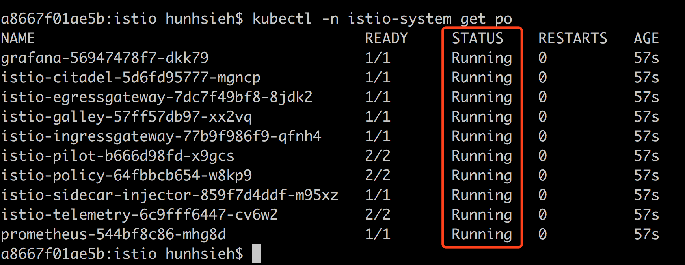
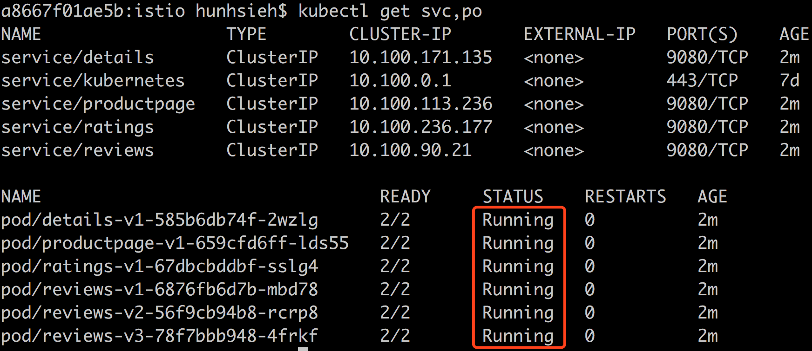
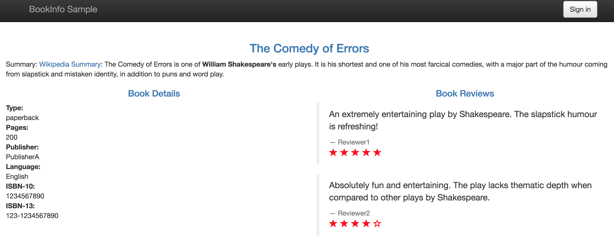
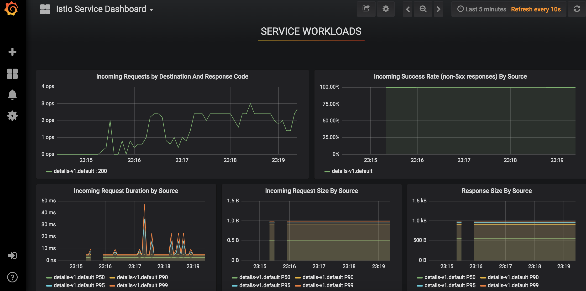
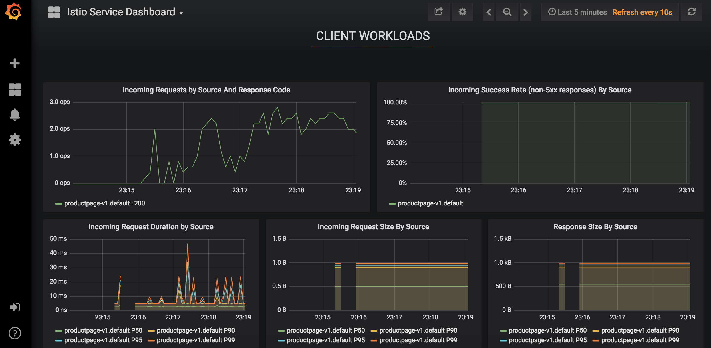
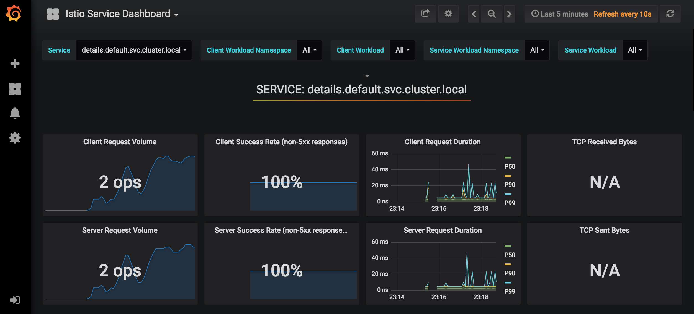

# Installing Istio 1.x on Amazon EKS


## Installation

1. Make sure you have Helm installed in Amazon EKS or follow this guide to complete the installation -  [Installing Helm in Amazon EKS](https://github.com/pahud/amazon-eks-workshop/blob/master/00-getting-started/installing-helm.md).

2. git clone the Istion repo to local

   ```
   git clone https://github.com/istio/istio.git
   ```

3. Install Istio into the cluster(this may take a few seconds)

   ```
   $ cd istio
   $ helm install install/kubernetes/helm/istio \
       --name istio \
       --namespace istio-system \
       --set grafana.enabled=true
   ```

4. Enabled istio injection on the default namespace

   ```
   $ kubectl label namespace default istio-injection=enabled --overwrite
   ```

5. `$ kubectl -n istio-system get po` and make sure all the pods are **Running**

   


## Running the bookinfo sample app

Istio official site has some examples availabe - https://istio.io/docs/examples/

Let's walk through the [Bookinfo Application](https://istio.io/docs/examples/bookinfo/) on Amazon EKS:


As we've enabled Istio auto-injection in step #4, let's simple deploy the service using `kubectl` :

```
$ kubectl apply -f samples/bookinfo/platform/kube/bookinfo.yaml
```

Confirm the services and pods all running

```
$ kubectl get svc,po
```




### Determine the Ingress Hostname and Port

define the ingress gateway for the application

```
$ kubectl apply -f samples/bookinfo/networking/bookinfo-gateway.yaml
```

confirm the gateway has been created

```
$ kubectl get gateway
NAME               AGE
bookinfo-gateway   33s
```

follow the instructions below to get `INGRESS_HOST` and `INGRESS_PORT`

```
export INGRESS_HOST=$(kubectl -n istio-system get service istio-ingressgateway -o jsonpath='{.status.loadBalancer.ingress[0].hostname}')
export INGRESS_PORT=$(kubectl -n istio-system get service istio-ingressgateway -o jsonpath='{.spec.ports[?(@.name=="http2")].port}')
export SECURE_INGRESS_PORT=$(kubectl -n istio-system get service istio-ingressgateway -o jsonpath='{.spec.ports[?(@.name=="https")].port}')

```

(please note we get `hostname` instead of `ip` because in AWS we have ELB DNS name as the ingress host )

set `GATEWAY_URL`

```
$ export GATEWAY_URL=$INGRESS_HOST:$INGRESS_PORT
```

check your `GATEWAU_URL`

```
$ echo $GATEWAY_URL
a220528a0c7e411e8b19d0a38c002e64-1191852839.us-west-2.elb.amazonaws.com:80
```

(your `GATEWAY_URL` would be different from the value above)


confirm the application is running

```
$ curl -o /dev/null -s -w "%{http_code}\n" http://${GATEWAY_URL}/productpage
200
```

Or simply open it `GATEWAY_URL` with your browser. You may reload the page to see different book reviews at random display.




### Apply default destination rules


```
$ kubectl apply -f samples/bookinfo/networking/destination-rule-all.yaml
```

Wait a few seconds for the destination rules to propagate.

Display the destination rules:

```
$ kubectl get destinationrules -o yaml
```


## Grafana service dashboard

create a `port-forward` to forward localhost `tcp:8080` to pod `tcp:3000`

```
$ kubectl -n istio-system port-forward deploy/grafana 8080:3000
Forwarding from 127.0.0.1:8080 -> 3000
Forwarding from [::1]:8080 -> 3000
```


open `http://localhost:8080` to see the dashboard. If you run this in Cloud9, click the `Preview` button to see the page with the built-in browser.









## clean up

Delete Isto with `helm`

```
$ helm del --purge istio
```


You may need to delete `customresources` as below, check [issue #7688](https://github.com/istio/istio/issues/7688)

```
$ kubectl delete -f install/kubernetes/helm/istio/templates/crds.yaml -n istio-system
```


Delete `bookinfo`

```
$ kubectl delete -f samples/bookinfo/platform/kube/bookinfo.yaml
```

remove the `instio-injection` namespace label

```
$ kubectl label namespace default istio-injection-
```


## Reference

Istio official docs - https://istio.io/docs/

Github - istio/istio - https://github.com/istio/istio

How to integrate AWS ALB with istio v1.0 by Chuan-Yen Chiang - https://medium.com/@cy.chiang/how-to-integrate-aws-alb-with-istio-v1-0-b17e07cae156
