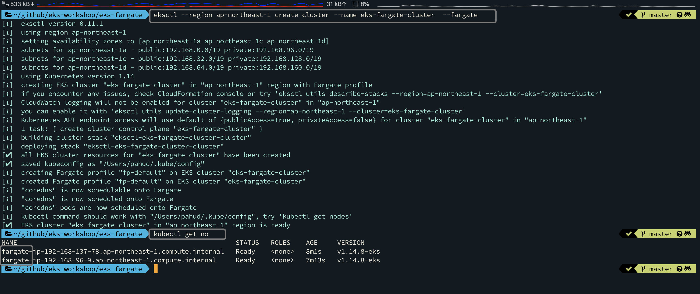
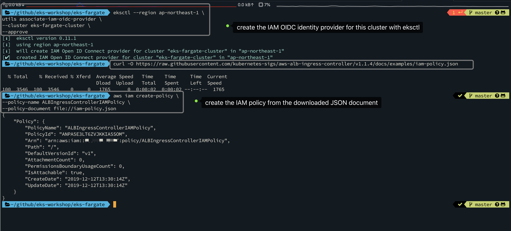
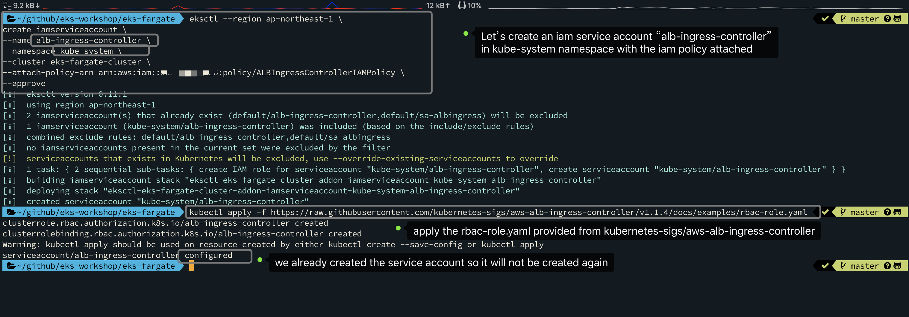
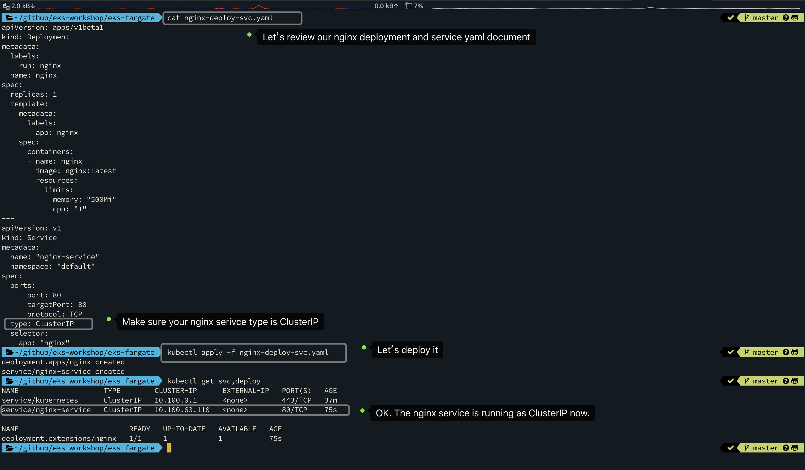
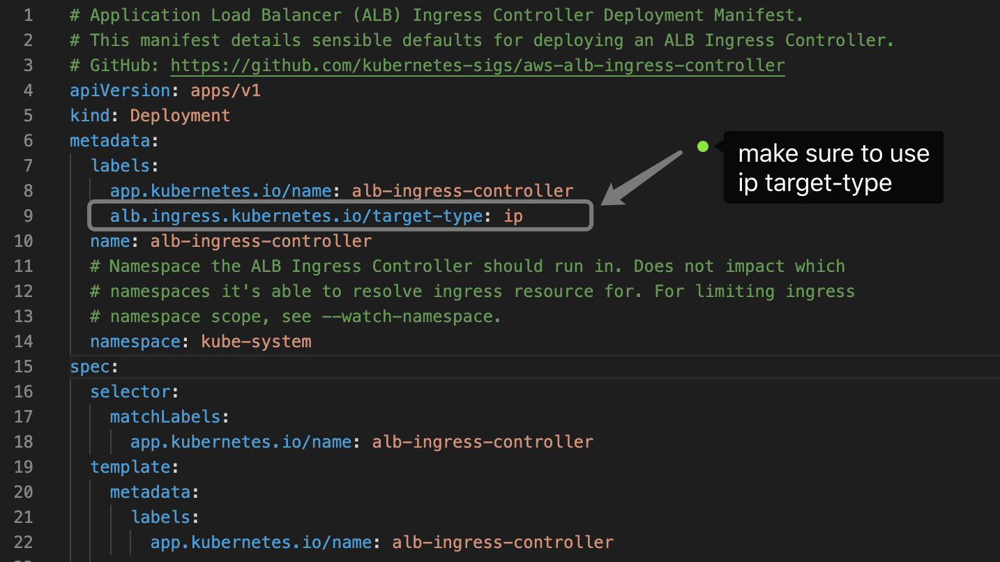
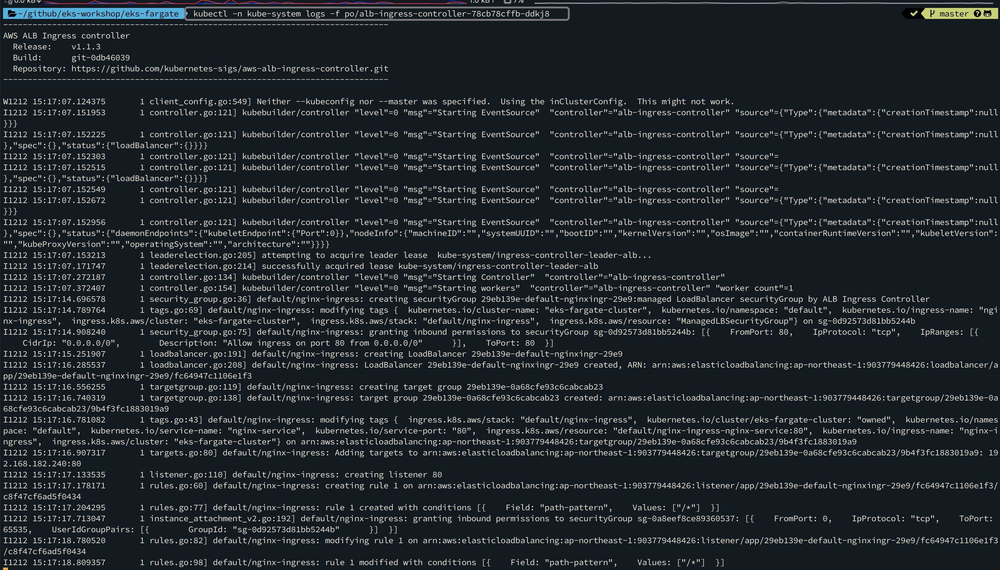
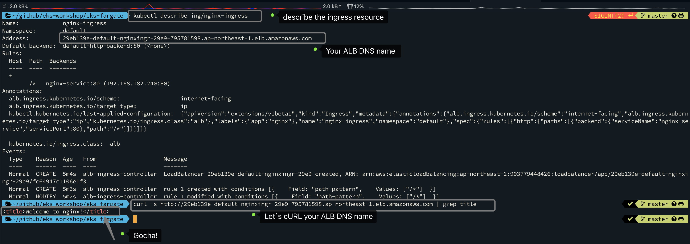

# Amazon EKS with AWS Fargate and ALB Ingress Controller

This guide walks you through building **Amazon EKS** with **AWS Fargate** to run your **nginx** deployment and service  with **alb-ingress-controller**.


1. create the cluster with **eksctl**

   ```sh
   $ eksctl --region ap-northeast-1 create cluster --name eks-fargate-cluster  --fargate
   ```

   

   

2. create iam oidc provider and associate with this cluster

```bash
$ eksctl --region ap-northeast-1 \
utils associate-iam-oidc-provider \
--cluster eks-fargate-cluster \
--approve
```

3. download the policy JSON document

```sh
$ curl -O https://raw.githubusercontent.com/kubernetes-sigs/aws-alb-ingress-controller/v1.1.4/docs/examples/iam-policy.json

```

4. create the IAM policy from the JSNO document

```sh
$ aws iam create-policy \
--policy-name ALBIngressControllerIAMPolicy \
--policy-document file://iam-policy.json
```



5. create a service account(**alb-ingress-controller**) for this cluster and attach the policy we just created to this service account

```sh
$ eksctl --region ap-northeast-1 \
create iamserviceaccount \
--name alb-ingress-controller \
--namespace kube-system \
--cluster eks-fargate-cluster \
--attach-policy-arn arn:aws:iam::112233445566:policy/ALBIngressControllerIAMPolicy \
--approve
```

6. Create a service account, cluster role, and cluster role binding for the ALB Ingress Controller to use with the following command. 

```sh
$ kubectl apply -f https://raw.githubusercontent.com/kubernetes-sigs/aws-alb-ingress-controller/v1.1.4/docs/examples/rbac-role.yaml
```




7. run the nginx deployment and service




8. download the `alb-ingress-controller.yaml`

```sh
$ wget https://raw.githubusercontent.com/kubernetes-sigs/aws-alb-ingress-controller/v1.1.4/docs/examples/alb-ingress-controller.yaml
```

edit the yaml and update the following arguments

- **--cluster-name**=eks-fargate-cluster
- **--aws-vpc-id**=vpc-xxxxxxxxxxxx
- **--aws-region**=ap-northeast-1

And make sure to specify the `ip` target-type




9. deploy the **alb-ingress-controller** now

```sh
$ kubectl apply -f alb-ingress-controller.yaml
```

10. deploy the ingress object

```sh
$ kubectl apply -f nginx-ingress.yaml
```

11. lookup the alb-ingress-controller pod name and watch its logs

```sh
# lookup the pod id
kubectl get po -A  | grep alb-ingress
# logs -f to watch the pod logs. Make sure you specify correct pod name
kubectl -n kube-system logs -f po/alb-ingress-controller-78cb78cffb-ddkj8
```





12. Now describe the ingress object to find out the **ALB DNS name** and curl the ALB



You will see the welcome message from nginx.

## clean up

```sh
kubectl delete -f nginx-deploy-svc.yaml
kubectl delete -f nginx-ingress.yaml
kubectl delete -f alb-ingress-controller.yaml
eksctl --region ap-northeast-1 delete cluster --name eks-fargate-cluster
```
